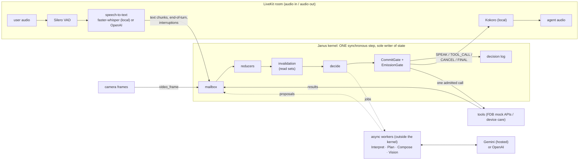

# Janus

A full-duplex, interruptible voice agent built around one idea: **no model ever acts on its own.** Language models only propose; a single synchronous kernel decides what actually happens, so a user can change their mind mid-sentence and the agent neither books twice nor claims something it did not do.

Built for the **Samsung PRISM GenAI Hackathon 3rd Edition, Theme 05: Interruptible Real-Time Agents**, and evaluated on **Full-Duplex-Bench v3 (FDB-v3)** over LiveKit.

> **Provider declaration.** Custom LiveKit agent (Janus). Decisions: the Janus kernel with **Gemini 3.6 Flash** (hosted Gemini API, thinking budget 0, temperature 0). Speech, all local on the GPU: **faster-whisper large-v3-turbo** (STT), **Kokoro-82M** (TTS), **Silero VAD**. Nothing else is called at evaluation time. Two switches can move decisions and/or speech-to-text to OpenAI instead (see [Keys](#keys)); every run writes the providers it actually used to `PROVIDER.txt`.
> (The Python import path is `prism_rt`; the distribution is named `janus`. That mismatch is deliberate.)

## Contents

1. [Reproduce the benchmark](#reproduce-the-benchmark-one-command) · 2. [Architecture](#architecture) · 3. [How an interruption flows](#how-an-interruption-flows) · 4. [Extension: device care](#extension-camera-grounded-device-care) · 5. [Results](#results) · 6. [Keys](#keys) · 7. [Tests](#tests) · 8. [Limitations](#honest-limitations) · 9. [Repo map](#repo-map) · 10. [Citations](#citations)

## Reproduce the benchmark (one command)

```bash
cp .env.example .env      # fill in the keys, see "Keys" below
./reproduce.sh            # all 100 scenarios, FDB's LLM judge on
```

Needs Docker with the NVIDIA container toolkit, an NVIDIA GPU (measured peak ~10 GB VRAM; the image uses CUDA 12 builds, so any driver ≥ 525), about 40 GB of disk and internet access.

What it does, in order:

1. Checks the environment (never prints key values), Docker, and that the GPU is visible inside the container.
2. Builds the pinned image `docker/fdb_v3/Dockerfile`. Whisper, Kokoro and FDB's Parakeet scoring ASR are baked in at pinned Hugging Face revisions, so nothing downloads mid-run.
3. Inside the container: clones FDB at commit `3e799c45…`, downloads its data and **verifies the sha256** before extracting.
4. Starts the Janus LiveKit worker, then runs **FDB's own runner** (`run_tool_benchmark_all_released.py --provider janus`) and **FDB's own three evaluators**, with `--use-llm`.
5. Writes `results/<timestamp>/`: `pass_rate_report.json`, `tool_calls_report.json`, latency report, per-room decision logs, `agent.log`, `manifest.json` (commit, package versions, the full profile, seeds, judge on/off), `PROVIDER.txt`, `SUMMARY.md`.

Options: `--ids "travel_01 finance_19"` runs a quick smoke test, `--no-judge` scores by exact match only, `--skip-build` reuses the image, `--low-vram` is a workaround for GPUs under 16 GB.

Seeds and randomness: the model call uses temperature 0 and the kernel is deterministic given its inputs (replay identity is a tested invariant). FDB's own mock-tool latency jitter is unseeded and a hosted model is not bit-reproducible, so two runs differ slightly. That is recorded in `manifest.json`, not hidden.

**Native fallback (no Docker).** On a Linux box with an NVIDIA GPU and root but no container runtime: `bash scripts/fdb_v3/native_setup.sh` (Python venv, PyTorch for CUDA 12.6, the pinned speech stack, a GPU check), then `scripts/fdb_v3/native_run.sh [--ids "travel_01 finance_19"]`. `native_run.sh` reads the same `.env` and runs exactly the `repro_inner.sh` that runs inside the container; the LLM judge is off unless `--judge` is passed.

## Architecture



The three rules everything else follows from:

- **Single writer.** One synchronous kernel step owns all state. Interpretation, planning, composing, vision and ASR run as async workers outside it and can only return *proposals*. The kernel never awaits inside a step, and all timing goes through a clock port, so runs are replayable byte for byte.
- **Optimistic concurrency with read sets.** Every proposal, call and pending utterance records the `(fact, version, digest)` it depended on. If any of them changed, the work is stale and is cancelled *in the same step*; if a value reverts (Pune → Mumbai → Pune) the digest matches again and nothing is redone.
- **Reads and writes are different.** Reads can be speculated, retried and run in parallel. A write passes one `CommitGate` (floor closed, explicit user intent, no duplicate fingerprint or lineage, the settle window elapsed) and is recorded in the effect ledger *before* it is emitted. That is what prevents a double booking.

`docs/prompt 2.txt` is the full architecture; `CLAUDE.md` is the short version.

## How an interruption flows

The kernel X-ray draws a session from its decision log: what the user said, what the kernel understood, what it held back, and which work it invalidated. Struck-through work never took effect.


*The user asks about an orange light, and 2.4 s later says "sorry, actually red". The orange lookup is invalidated and cancelled in the same kernel step the correction arrives, and re-run with red. One final answer, grounded in the red result.* Interactive versions: [`docs/xray/correct_a_running_lookup.html`](docs/xray/correct_a_running_lookup.html), [`docs/xray/correct_before_booking.html`](docs/xray/correct_before_booking.html). Regenerate with `PYTHONPATH=src:. python scripts/make_xray.py`; a live session writes its own logs when `JANUS_DECISION_LOG_DIR` is set, and `python -m prism_rt.observability.xray DECISIONS.jsonl WIRE.jsonl out.html` draws them.

## Extension: camera-grounded device care

**This is the use-case extension.** A user points a phone camera at a device and talks to it. Janus reads the frame, looks the problem up, gives the fix steps, and books **exactly one** technician visit, even if the user changes their mind mid-sentence.

```
"My router has a blinking light that is not green. What does it mean?"
   camera frame -> vision: led_color=orange, led_name=internet   (the user never said which light)
   -> identify_indicator(router, orange, blinking, internet)
"The orange internet light means the router cannot reach the internet ..."
"Okay, how do I fix it?"                          -> get_fix_steps  (the diagnosed case)
"Book a technician for Thursday morning ... no wait, make it Friday afternoon."
   -> the Thursday request is superseded before anything is booked
   -> book_technician(Friday, afternoon)  x1
"Your technician is booked for Friday afternoon."
```

- **Tools** (mock services over a small local knowledge base, `src/prism_rt/devicecare/`): `identify_indicator`, `lookup_error_code`, `get_fix_steps`, `check_warranty` (reads) and `book_technician`, `open_support_ticket` (writes). Two devices: a Wi-Fi router (LED patterns) and a washing machine (error codes, so it also works audio-only).
- **Same kernel, different profile.** `demo_config()` in `src/prism_rt/profiles.py`: vision on, tool mutability declared by the manifest, a booking needs the user's explicit go-ahead and waits out the settle window, missing details are asked about instead of assumed.
- **Conversation safeguards**, each from a live session and each with a regression test:
  - A booking without a clear go-ahead is not made in silence: the agent asks *"Shall I go ahead and book technician (Friday, afternoon)?"* and a yes supplies the go-ahead.
  - A change after a booking went through is never re-run as a second booking: *"That's already done — book technician (Thursday, morning) went through. I can't change it from here, and I won't make a second one."* A new request for the same kind of booking asks first and names the one that already stands.
  - A missing detail is asked with its allowed values (*"What's the time slot: morning, afternoon or evening?"*), and the camera can answer a question the plan already asked.
  - A question about something an earlier result said (*"What's my router's name?"*) is answered from that result; a request no tool covers is declined honestly, with what the agent can do instead.
- **Camera.** The worker samples the room's video track at about 1 frame per second into JPEGs (`src/prism_rt/voice/camera.py`). The kernel only sees a `frame_id`; the vision worker resolves the bytes.

Run it:

```bash
# 1. Text + camera image, live Gemini (fastest way to see it):
PYTHONPATH=src:. python demo/run_device_care_demo.py [--image photo.jpg] [--trace]

# 2. Voice + real camera, in a browser: start the worker in demo mode ...
JANUS_MODE=demo JANUS_STT=openai JANUS_DECISION_LOG_DIR=run_output/demo python -m prism_rt.voice.agent start
#    ... make a token that asks for the demo agent by name ...
python scripts/make_demo_token.py
#    ... and join from the LiveKit Agents Playground (https://agents-playground.livekit.io,
#    manual connect: paste the URL and token), enable microphone and camera, and talk.
#    The demo worker registers as "janus-demo" and joins only rooms that ask for it, so it
#    never takes a benchmark room on the same LiveKit project. Hosted transcription
#    (JANUS_STT=openai) copes better with accents; use headphones so the agent does not
#    hear itself.
```

Tested without a network in `tests/test_devicecare.py`; the camera pump was checked against LiveKit Cloud with a synthetic video track.

## Results

All numbers below are FDB-v3's own runner and evaluators, unmodified, at the pinned commit, with `gpt-4o` as the LLM judge. **Run logs, reports, configuration and seeds of the voice runs are in [`docs/runs/`](docs/runs/)** (audio left out); the headline numbers are summarised in `docs/measurements.md`.

| Setting | Strict pass rate (Pass@1) | Tool selection | Argument accuracy | Response quality |
|---|---|---|---|---|
| **Janus, text replay** (reasoning & safety core), all 100 scenarios, Gemini 3.6 Flash | **77.0 %** | 0.959 | 0.807 | 0.840 |
| Janus, **voice** over LiveKit, all 100 recordings, cloud RTX 3090, native path (29–30 Sep, before the fixes below) | 42.0 % | 0.844 | 0.611 | 0.597 |
| Janus, **voice**, 32-recording rerun of that run's hardest recordings, after the speech-to-text GPU fix | 11 / 32 (was 8 / 32) | | | exact-match; turn-taking 32 / 32 (was 72 %); first word 7.8 s mean |
| Published FDB-v3 baselines (paper, Table 2): GPT-Realtime / Gemini Live 3.1 / Cascaded | 60.0 % / 54.0 % / 45.0 % | 0.876 / 0.817 / 0.803 | 0.680 / 0.588 / 0.562 | 0.792 / 0.718 / 0.600 |

Read this table carefully:

- The **text-replay** row feeds each recording's ground-truth transcript straight to the kernel. It measures the reasoning and safety core, not speech recognition, turn-taking or latency, so it is *not* comparable to the voice-native baselines on those.
- The **full voice run** is the real audio path. Its decision logs showed the gap was mostly infrastructure, and each cause is now fixed with a regression test:
  - Speech-to-text silently fell back from GPU to CPU in every job process started after the first ~75 recordings, so the agent heard users ~29 s late. It is now logged, GPU memory is recorded, and the fallback can be made fatal.
  - A kernel liveness bug left a clarifying question undispatched when no other event arrived.
  - The stall timeout could fire while the user was still speaking.
  - Whisper's silence hallucinations ("you", "Hmm.") were taken as turns.
  - Spoken codes ("F A S T nine nine") were not joined into identifiers.
  
  Eight recordings were also lost to the benchmark client itself aborting after the stream; our decision logs show correct tool calls in six of them. The full voice run has not yet been repeated with these fixes.
- **Turn-taking and latency** on the post-fix rerun: the agent responded in all 32 recordings; mean time to its first word was 7.8 s (median 6.7 s). Published first-word means (paper Table 6): GPT-Realtime 6.36 s, Gemini Live 3.1 3.95 s, the cascaded pipeline 8.78 s. Part of ours is deliberate: a turn closes after 1.5 s of silence, and a call waits a settle window so a correction can still land.
- By domain (text replay): finance 100 %, travel 95 %, e-commerce 83 %, **housing 35 %**. Housing is the weakest domain for every published system too; ours fails mostly on argument values in long, constraint-heavy requests.
- **Self-correction** ("…no wait, make it Friday") is the category the paper finds hardest for every system (Table 3, Pass@1 per category: GPT-Realtime 0.588, Gemini Live 3.1 0.353, the cascaded Whisper pipeline 0.176). It is what the kernel is built for: **0.824** in text replay, and **0.412** on the voice run above, against 0.176 for the published cascaded pipeline, the same family as ours.
- The organizers' own re-run is what scores. `./reproduce.sh` produces the voice-path number on their hardware.

## Keys

Copy `.env.example` to `.env`. It is git-ignored; keys are never in the repo.

| Variable | Used for |
|---|---|
| `LIVEKIT_URL`, `LIVEKIT_API_KEY`, `LIVEKIT_API_SECRET` | Any LiveKit Cloud project; FDB's client and the Janus worker meet in a room there. |
| `GEMINI_API_KEY` | The hosted model behind Interpret / Plan / Compose / Vision (Google AI Studio). About 500 calls per full run. |
| `OPENAI_API_KEY` | FDB's LLM judge (semantic argument matching, response quality). Optional with `--no-judge`. Also used by the two OpenAI options below. |

Two optional switches choose the hosted services (set them in `.env` or the shell):

| Variable | Values | Effect |
|---|---|---|
| `JANUS_LLM_PROVIDER` | `gemini` (default) · `openai` | The model behind the kernel's decisions (`openai` = gpt-4.1, equal to Gemini 3.6 Flash on our judged 15-recording comparison). |
| `JANUS_STT` | `local` (default) · `openai` | Speech-to-text: faster-whisper on the GPU, or OpenAI's `gpt-4o-mini-transcribe-2025-12-15` (pinned snapshot). |

With both set to `openai`, a run needs only LiveKit and OpenAI keys: the same OpenAI key the judge already uses. To keep an OpenAI key off a GPU machine you don't control, run `scripts/fdb_v3/openai_stt_relay.py` on your own machine and open a reverse SSH tunnel. The relay adds the key itself and forwards only transcription requests; the script's docstring has the commands.

## Tests

```bash
python3 -m venv .venv && source .venv/bin/activate && pip install -e ".[dev]"
python -m pytest tests/ -q          # 493 tests, deterministic: stepped clock, scripted model, mock tools
docker build -t janus . && docker run --rm janus     # the same suite on Python 3.11
```

Tests use no real sleeps and no live model. Every scenario also runs `TraceChecker` over the decision log (no event reordering, floor rule, no stale consumption, no false completion claim, one confirmed write per lineage, and more), and a bounded adversarial explorer perturbs latencies around 19 race scenarios. The full voice path (LiveKit, GPU models) is only exercised by `reproduce.sh` and the demo worker, not by pytest.

## Honest limitations

- **The number that scores is the voice path.** Our full voice run (42 %) predates the fixes above and has not been repeated on all 100; the text-replay figure is not a substitute.
- **`./reproduce.sh` has been verified in its parts but not end to end.** Our voice runs used the same inner script natively (`scripts/fdb_v3/native_run.sh`) on a cloud GPU without Docker.
- **Speech-to-text still mishears some names** (e.g. a city); replacing faster-whisper with Parakeet ASR is the next step.
- **Housing (35 %)** is the weakest domain; argument values in long constraint-heavy requests are the main loss.
- **The model is a hosted API.** Temperature 0 does not make it bit-reproducible, and evaluation needs network access to Gemini.
- **No cancel or modify tool.** A booking that went through cannot be changed; the agent says so and will not make a second one without an explicit yes, but it cannot undo the first.
- **Camera:** one frame per second, one still image per question. It cannot tell a *blinking* light from a solid one, so the user says that part.
- **The extension's tools are mocks** over a small knowledge base of two devices; it demonstrates the safe-action pattern, not a product catalogue.
- Python 3.10/3.12 are supported by construction only; the tested targets are 3.11 (Docker) and the 3.14 dev venv.

## Repo map

| Path | What |
|---|---|
| `reproduce.sh`, `scripts/fdb_v3/` | One-command reproduction; FDB fetch/verify, in-container run, text-replay harness, manifest writer |
| `src/prism_rt/kernel/` | The single-writer step, reducers, invalidation, task state machine, CommitGate, responder |
| `src/prism_rt/workers/` | Interpreter, Planner, Composer, Vision, ASR, model gateway (workers never import the kernel) |
| `src/prism_rt/voice/` | The LiveKit worker (`agent.py`), local speech (`speech.py`), camera sampling (`camera.py`) |
| `src/prism_rt/devicecare/` | The extension's tools and knowledge base |
| `src/prism_rt/observability/` | Decision log, watchdog, metrics, kernel X-ray |
| `src/prism_rt/sim/` | Deterministic harness, `TraceChecker`, adversarial explorer |
| `docs/` | Architecture (`prompt 2.txt`), measurements, integration notes, [version history](docs/history.md) |
| `currentStatus.md`, `CLAUDE.md` | Live project state and working rules |

## Citations

- **Full-Duplex-Bench v3** — Lin, Chen, Chen, Lee (NTU, NVIDIA), arXiv 2604.04847; code at github.com/DanielLin94144/Full-Duplex-Bench (pinned commit `3e799c45`).
- **LiveKit Agents** 1.8.3 and the LiveKit Cloud media server.
- **faster-whisper** (CTranslate2) with OpenAI Whisper large-v3-turbo weights; **Kokoro-82M** (hexgrad); **Silero VAD**; **NVIDIA Parakeet-TDT 0.6B v2** and NeMo (FDB's own scorer).
- **Gemini** (Google) as the hosted decision model; **GPT-4o** as FDB's judge.
