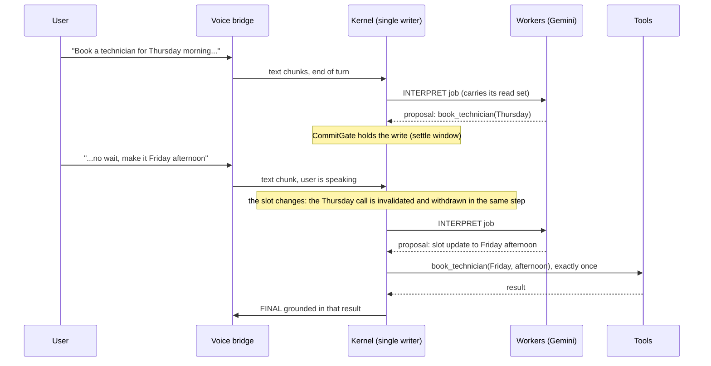
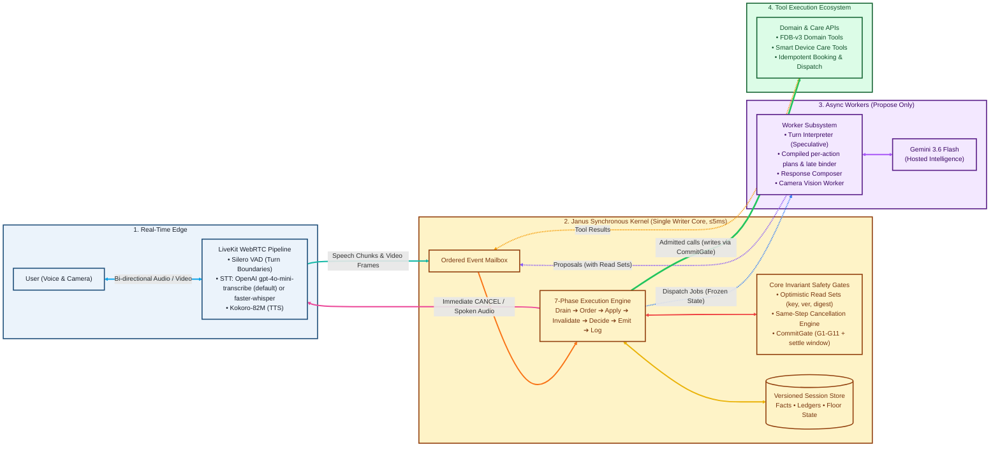

# Janus

A full-duplex, interruptible voice agent built around one idea: **no model ever acts on its own.** Language models only propose; a single synchronous kernel decides what actually happens, so a user can change their mind mid-sentence and the agent neither books twice nor claims something it did not do.

Built for the **Samsung PRISM GenAI Hackathon 3rd Edition, Theme 05: Interruptible Real-Time Agents**, and evaluated on **Full-Duplex-Bench v3 (FDB-v3)** over LiveKit.

**Demo video:** [Google Drive](https://drive.google.com/drive/folders/1voRXefVFo-aI9aMh7W6LHp6Px0K2_CcE?usp=drive_link) · **Slide deck:** [Google Slides](https://docs.google.com/presentation/d/16pbvTmVLDricxOrwYgVnJDcXBt5EJ9KR/edit?usp=sharing&ouid=117062392495455542034&rtpof=true&sd=true)

**Highlights**
- **74 % strict pass rate on the full voice path** (all 100 FDB-v3 recordings over LiveKit, judged with gpt-4o, final code), against 60 % for the best published system (GPT-Realtime); 77 % for the reasoning core in text replay. Three full voice runs on 3 Oct scored 73, 65 and 74; the 65 is explained and fixed (below), and single runs vary by a few points. Every run is recorded in [`BENCHMARKS.md`](BENCHMARKS.md).
- **Self-correction, the category FDB-v3 finds hardest for every system:** 0.765 Pass@1 on the final voice run, against 0.176 for the published cascaded pipeline (the same family as ours) and 0.588 for GPT-Realtime; 0.824 for the reasoning core in text replay.
- **No double actions, no false claims, by construction:** every write passes one commit gate and is recorded before it is emitted; a correction cancels stale work in the same kernel step.
- **Deterministic and replayable:** 635 tests on a stepped clock with a trace checker over every decision log, plus an adversarial explorer over 19 race scenarios.
- **Use-case extension:** camera-grounded device care over live voice: it reads the device from the camera, diagnoses it, and books exactly one technician visit.

> **Provider declaration.** Custom LiveKit agent (Janus). Decisions: the Janus kernel with **Gemini 3.6 Flash** (hosted Gemini API, thinking budget 0, temperature 0). Speech-to-text: **OpenAI `gpt-4o-mini-transcribe-2025-12-15`** (hosted, pinned snapshot). Local on the GPU: **Kokoro-82M** (TTS), **Silero VAD**. Nothing else is called at evaluation time. Keys needed: LiveKit, `GEMINI_API_KEY`, `OPENAI_API_KEY` (see [Keys](#keys)). Two switches change the providers: `JANUS_STT=local` runs faster-whisper large-v3-turbo on the GPU instead, and `JANUS_LLM_PROVIDER=openai` moves decisions to OpenAI (see [Keys](#keys)); every run writes the providers it actually used to `PROVIDER.txt`.
> (The Python import path is `prism_rt`; the distribution is named `janus`. That mismatch is deliberate.)

## Contents

1. [Why this architecture](#why-janus-is-built-this-way) · 2. [Reproduce the benchmark](#reproduce-the-benchmark-one-command) · 3. [Architecture](#architecture) · 4. [How an interruption flows](#how-an-interruption-flows) · 5. [Extension: device care](#extension-camera-grounded-device-care) · 6. [Results](#results) · 7. [Benchmark labels](#benchmark-labels-and-the-published-tools) · 8. [Keys](#keys) · 9. [Tests](#tests) · 10. [Limitations](#limitations) · 11. [Repo map](#repo-map) · 12. [Citations](#citations)

## Why Janus is built this way

**The problem.** Most voice agents are one loop: the model decides, calls a tool, speaks. That loop is fine until the user interrupts. Then it fails in three specific ways: a **race** (the user corrects a value while a lookup is running, and the stale answer is spoken anyway), a **phantom completion** (the agent says "booked" for something that was cancelled or never ran), and a **duplicate side effect** (a retry or a correction books twice). None of these is a prompting problem. They come from letting a model own the state and the side effects.

**The idea.** Models never act. Every language-model call (interpret, plan, bind, compose, vision) is an asynchronous *worker* that returns a **proposal**. One synchronous **kernel** owns all session state and is the only thing that can speak, call a tool or cancel. Each guarantee below is an enforced mechanism with a test, not an instruction in a prompt:

| Guarantee | Mechanism | Where |
|---|---|---|
| A correction cancels stale work **in the same step** it arrives | Every proposal, call and pending utterance records the `(fact, version, digest)` it read; a changed fact invalidates its dependents and the CANCEL is emitted before any new speech or call | `kernel/invalidation.py`, `store/facts.py` |
| A value that changes back (Pune, Mumbai, Pune) redoes nothing | Read sets compare digests, not a generation counter | `canonical.py`, `store/facts.py` |
| No write fires while the user is still talking, before their go-ahead, or inside the settle window | `CommitGate` G1–G11: floor closed, explicit intent (required in the device-care profile), settle barrier, valid read set at emission | `kernel/commit.py`, `kernel/emission.py` |
| No double booking | Fingerprint (G5) and plan-step lineage (G6) checks; the write is recorded in the effect ledger *before* it is emitted | `store/ledgers.py` |
| No false "done" | A final answer is grounded in tool results the kernel consumed; failures, refusals and skipped steps are reported as not done, with `task_completed=false` | `kernel/responder.py`, `kernel/frames.py` |
| An action the user ruled out never runs | "If it is under $50 add it, otherwise track my order": the condition is checked against the real result before the step may run; an action the user calls off is left out of the plan | `kernel/binder.py`, `kernel/action_plans.py`, `workers/interpreter.py` |
| Everything is replayable | One synchronous step on an injected clock: the same input gives a byte-identical decision log, a required test | `sim/`, `observability/` |



**Why this is not a benchmark trick.** The same kernel runs the Full-Duplex-Bench voice benchmark and the camera-grounded device-care extension; only a configuration profile differs (`fdb_v3_config`, `demo_config` in `src/prism_rt/profiles.py`). New kernel behaviour is added behind a `Config` flag and covered by tests; the tagged versions V0–V4 and six post-V4 phases each stayed runnable.

**Evidence, not claims**
- **635 deterministic tests** on a stepped clock with a scripted model, and a trace checker that audits every decision log (no event reordering, floor rule, no stale consumption, no false completion claim, one confirmed write per lineage).
- **A bounded adversarial explorer** perturbs tool and worker latencies and user timing around 19 race scenarios, with oracles re-derived from state; its first run found three real kernel bugs, all fixed with regression tests.
- **Independent reviews are logged, not trusted:** every round's findings were reproduced before a fix shipped, and the ones that did not hold up are recorded too ([`reviews/index.md`](reviews/index.md), [`reviews/audit-2026-10-01.md`](reviews/audit-2026-10-01.md)).
- **On the hardest benchmark category** (self-correction), 0.765 Pass@1 on the full voice path, against 0.176 for the published cascaded pipeline of the same family. See [Results](#results).
- A step-by-step tour of the code is in [`docs/architecture_walkthrough.md`](docs/architecture_walkthrough.md).

## Reproduce the benchmark (one command)

```bash
cp .env.example .env      # fill in the keys, see "Keys" below
./reproduce.sh            # all 100 scenarios, FDB's LLM judge on
```

Needs Docker with the NVIDIA container toolkit, an NVIDIA GPU (measured peak ~10 GB VRAM; the image uses CUDA 12 builds, so any driver ≥ 525), about 40 GB of disk and internet access.

What it does, in order:

1. Checks the environment (never prints key values), Docker, and that the GPU is visible inside the container.
2. Builds the pinned image `docker/fdb_v3/Dockerfile`. Whisper, Kokoro and FDB's Parakeet scoring ASR are baked in at pinned Hugging Face revisions, so nothing downloads mid-run.
3. Inside the container: clones FDB at commit `3e799c45…`, downloads its data and **verifies the sha256** before extracting.
4. Starts the Janus LiveKit worker, then runs **FDB's own runner** (`run_tool_benchmark_all_released.py --provider janus`) and **FDB's own three evaluators**, with `--use-llm`.
5. Writes `results/<timestamp>/`: `pass_rate_report.json`, `tool_calls_report.json`, latency report, per-room decision logs, `agent.log`, `manifest.json` (commit, package versions, the full profile, seeds, judge on/off), `PROVIDER.txt`, `SUMMARY.md`.

Options: `--ids "travel_01 finance_19"` runs a quick smoke test, `--no-judge` scores by exact match only, `--skip-build` reuses the image, `--low-vram` is a workaround for GPUs under 16 GB.

Seeds and randomness: the model call uses temperature 0 and the kernel is deterministic given its inputs (replay identity is a tested invariant). FDB's own mock-tool latency jitter is unseeded and a hosted model is not bit-reproducible, so two runs differ slightly. That is recorded in `manifest.json`, not hidden.

**Native fallback (no Docker).** On a Linux box with an NVIDIA GPU and root but no container runtime: `bash scripts/fdb_v3/native_setup.sh` (Python venv, PyTorch for CUDA 12.6, the pinned speech stack, a GPU check), then `scripts/fdb_v3/native_run.sh [--ids "travel_01 finance_19"]`. `native_run.sh` reads the same `.env` and runs exactly the `repro_inner.sh` that runs inside the container; the LLM judge is off unless `--judge` is passed.

## Architecture




The three rules everything else follows from:

- **Single writer.** One synchronous kernel step owns all state. Interpretation, planning, composing, vision and ASR run as async workers outside it and can only return *proposals*. The kernel never awaits inside a step, and all timing goes through a clock port, so runs are replayable byte for byte.
- **Optimistic concurrency with read sets.** Every proposal, call and pending utterance records the `(fact, version, digest)` it depended on. If any of them changed, the work is stale and is cancelled *in the same step*; if a value reverts (Pune → Mumbai → Pune) the digest matches again and nothing is redone.
- **Reads and writes are different.** Reads can be speculated, retried and run in parallel. A write passes one `CommitGate` (floor closed, explicit user intent, no duplicate fingerprint or lineage, the settle window elapsed) and is recorded in the effect ledger *before* it is emitted. That is what prevents a double booking.

The full architecture specification is in `docs/prompt 2.txt`.

## How an interruption flows

The kernel X-ray draws a session from its decision log: what the user said, what the kernel understood, what it held back, and which work it invalidated. Struck-through work never took effect.


*The user asks about an orange light, and 2.4 s later says "sorry, actually red". The orange lookup is invalidated and cancelled in the same kernel step the correction arrives, and re-run with red. One final answer, grounded in the red result.* Interactive versions: [`docs/xray/correct_a_running_lookup.html`](docs/xray/correct_a_running_lookup.html), [`docs/xray/correct_before_booking.html`](docs/xray/correct_before_booking.html), and for the extension [`docs/xray/withdraw_one_of_two_writes.html`](docs/xray/withdraw_one_of_two_writes.html) (two writes pending, a correction withdraws one before it is sent; drawn as a struck "never sent" row). Regenerate with `PYTHONPATH=src:. python scripts/make_xray.py`; a live session writes its own logs when `JANUS_DECISION_LOG_DIR` is set, and `python -m prism_rt.observability.xray DECISIONS.jsonl WIRE.jsonl out.html` draws them.

## Extension: camera-grounded device care

**This is the use-case extension.** A user points a phone camera at a device and talks to it. Janus reads the frame, looks the problem up, gives the fix steps, and books **exactly one** technician visit, even if the user changes their mind mid-sentence.

```
"My router has a blinking light that is not green. What does it mean?"
   camera frame -> vision: led_color=orange, led_name=internet   (the user never said which light)
   -> identify_indicator(router, orange, blinking, internet)
"The orange internet light means the router cannot reach the internet ..."
"Okay, how do I fix it?"                          -> get_fix_steps  (the diagnosed case)
"Book a technician for Thursday morning ... no wait, make it Friday afternoon."
   -> the Thursday request is superseded before anything is booked
   -> book_technician(Friday, afternoon)  x1
"Your technician is booked for Friday afternoon."
```

- **Tools** (mock services over a small local knowledge base, `src/prism_rt/devicecare/`): `identify_indicator`, `lookup_error_code`, `get_fix_steps`, `check_warranty`, `get_device_status` (reads) and `book_technician`, `open_support_ticket`, `control_appliance` (writes). Two devices: a Wi-Fi router (LED patterns) and a Samsung-style washing machine (Samsung's published error codes 4C, 5C, UB and dC, and a status shaped like a SmartThings washer, so it also works audio-only).
- **What is real and what is simulated.** Real: speech in and out, turn-taking, the camera frames, the reasoning and vision model, and the Janus kernel (corrections, commit gate, effect ledger). **Simulated: the device backend** (SmartThings-style status and control) **and the Samsung Care booking and ticket services.** Nothing here calls a Samsung API; the device adapter is replaceable through the tool manifest, and the contribution is the coordination layer above it.
- **Effect ledger.** At the end of a demo run (and in the worker's log when a voice session ends) the kernel reports what the session did to the world: writes committed, writes withdrawn before they were sent, writes the device or service refused, and duplicates (always 0). A command the washer refuses ("resume" while it shows 4C) is reported as refused, never as done.
- **Same kernel, different profile.** `demo_config()` in `src/prism_rt/profiles.py`: vision on, tool mutability declared by the manifest, a booking needs the user's explicit go-ahead and waits out the settle window, missing details are asked about instead of assumed.
- **Conversation safeguards**, each from a live session and each with a regression test:
  - A booking without a clear go-ahead is not made in silence: the agent asks *"Shall I go ahead and book technician (Friday, afternoon)?"* and a yes supplies the go-ahead.
  - A change after a booking went through is never re-run as a second booking: *"That's already done — book technician (Thursday, morning) went through. I can't change it from here, and I won't make a second one."* A new request for the same kind of booking asks first and names the one that already stands.
  - A device command the manifest declares `repeatable` (`control_appliance`) is a new command in each request: "stop" after "resume" runs, while a repeated booking is still asked about first. While the agent waits for a yes to "shall I go ahead?", the 15 s stall safety net stays quiet.
  - A missing detail is asked with its allowed values (*"What's the time slot: morning, afternoon or evening?"*), and the camera can answer a question the plan already asked.
  - A question about something an earlier result said (*"What's my router's name?"*) is answered from that result; a request no tool covers is declined honestly, with what the agent can do instead.
- **Camera.** The worker samples the room's video track at about 1 frame per second into JPEGs (`src/prism_rt/voice/camera.py`). The kernel only sees a `frame_id`; the vision worker resolves the bytes.

The washer story, same safeguards:

```
"My washing machine stopped in the middle of a wash. What's wrong with it?"   -> get_device_status: paused, error 4C
"How do I fix it?"                                                          -> tap, inlet hose, inlet filter
"Can you resume the wash?"   -> the washer refuses (4C still showing); the agent says so, nothing is claimed done
"Okay, then stop the wash."  -> a second command to the same washer: a new command, not a repeat; it stops
"Open an urgent ticket and book a technician for Friday afternoon ... no wait, Saturday morning."
   -> one ticket, one booking, Saturday morning; Friday is never booked
   Effect ledger: 3 committed, 1 refused, 0 duplicates
```


Run it:

```bash
# 1. Text + camera image, live Gemini (fastest way to see it); --story router (default) or washer:
PYTHONPATH=src:. python demo/run_device_care_demo.py [--story washer] [--image photo.jpg] [--trace]

# 2. Voice + real camera, in a browser: start the worker in demo mode ...
JANUS_MODE=demo JANUS_STT=openai JANUS_DECISION_LOG_DIR=run_output/demo python -m prism_rt.voice.agent start
#    ... make a token that asks for the demo agent by name ...
python scripts/make_demo_token.py
#    ... and join from the LiveKit Agents Playground (https://agents-playground.livekit.io,
#    manual connect: paste the URL and token), enable microphone and camera, and talk.
#    The demo worker registers as "janus-demo" and joins only rooms that ask for it, so it
#    never takes a benchmark room on the same LiveKit project. Hosted transcription
#    (JANUS_STT=openai) copes better with accents; use headphones so the agent does not
#    hear itself.
```

A step-by-step guide for running it on a laptop (no GPU needed), with the lines to say, is [`docs/demo_guide.md`](docs/demo_guide.md); the router image the camera reads is `demo/router_panel.png`. Tested without a network in `tests/test_devicecare.py`; the camera pump was checked against LiveKit Cloud with a synthetic video track.

## Results

All numbers below are FDB-v3's own runner and evaluators, unmodified, at the pinned commit, with `gpt-4o` as the LLM judge. **Run logs, reports, configuration and seeds of the voice runs are in [`docs/runs/`](docs/runs/)** (audio left out); the headline numbers are summarised in `docs/measurements.md`.

| Setting | Strict pass rate (Pass@1) | Tool selection | Argument accuracy | Response quality |
|---|---|---|---|---|
| **Janus, text replay** (reasoning & safety core), all 100 scenarios, Gemini 3.6 Flash | **77.0 %** | 0.959 | 0.807 | 0.840 |
| **Janus, voice over LiveKit, all 100 recordings, final code, hosted speech-to-text, cloud RTX 3090, native path (3 Oct, evening)** | **74.0 %** (68 / 100 exact-match) | 0.959 | 0.780 | 0.720 | judged; turn-taking 100 / 100; first word 8.5 s mean; no client aborts; [report](BENCHMARK_FULL100_FINAL_2026-10-03.md) |
| Janus, voice, all 100 recordings, same box and providers, before the 3 Oct fixes (3 Oct, morning) | 73.0 % (68 / 100 exact-match) | 0.947 | 0.768 | 0.626 | judged; turn-taking 99 / 100; first word 8.1 s mean; [report](BENCHMARK_FULL100_2026-10-03.md) |
| Janus, voice, all 100 recordings, an intermediate commit, while hosted speech-to-text was slow (3 Oct, afternoon) | 65.0 % | 0.917 | 0.704 | 0.616 | judged; 19 turns closed while their last sentence was still being transcribed (cause below, fixed) |
| Janus, **voice** over LiveKit, all 100 recordings, cloud RTX 3090, native path (29–30 Sep, before the fixes below) | 42.0 % | 0.844 | 0.611 | 0.597 |
| Janus, **voice**, 32-recording rerun of that run's hardest recordings, after the speech-to-text GPU fix | 11 / 32 (was 8 / 32) | | | exact-match; turn-taking 32 / 32 (was 72 %); first word 7.8 s mean |
| Janus, **voice**, current code with hosted speech-to-text, on recordings the full run failed (30 Sep) | 13 / 31 (the same recordings: 4 / 30 in the full run) | | | judged; turn-taking 64 / 64 |
| Janus, **voice**, current code (2 Oct, local speech-to-text), 26 recordings including the earlier turn-splitting failures | 16 / 26 (the same recordings: 12 / 26 on 30 Sep) | | | exact-match; turns cut off mid-sentence: 0 (31 on 30 Sep); judge not run |
| Published FDB-v3 baselines (paper, Table 2): GPT-Realtime / Gemini Live 3.1 / Cascaded | 60.0 % / 54.0 % / 45.0 % | 0.876 / 0.817 / 0.803 | 0.680 / 0.588 / 0.562 | 0.792 / 0.718 / 0.600 |

Notes on the table:

- The **text-replay** row feeds each recording's ground-truth transcript straight to the kernel. It measures the reasoning and safety core, not speech recognition, turn-taking or latency, so it is *not* comparable to the voice-native baselines on those.
- The **full voice run** is the real audio path. Its decision logs showed the gap was mostly infrastructure, and each cause is now fixed with a regression test:
  - Speech-to-text silently fell back from GPU to CPU in every job process started after the first ~75 recordings, so the agent heard users ~29 s late. It is now logged, GPU memory is recorded, and the fallback can be made fatal.
  - A kernel liveness bug left a clarifying question undispatched when no other event arrived.
  - The stall timeout could fire while the user was still speaking.
  - Whisper's silence hallucinations ("you", "Hmm.") were taken as turns.
  - The voice bridge restarted its end-of-turn timer whenever a transcript arrived. Hosted transcription lands about a second after its segment, usually after the user had resumed, so turns were closed mid-sentence (86 early closes across 52 of 72 recordings). End-of-turn now follows the user's silence, waits for outstanding transcripts, and the kernel is told when the user is speaking. On 26 recordings re-run on 2 Oct: 0 early closes (31 before) and 16 passes (12 before).
  - Spoken codes ("F A S T nine nine") were not joined into identifiers.
  - (3 Oct) The bridge gave up on an outstanding transcript after a fixed 4 s. On a day when hosted transcription of long sentences took 4–10 s, 19 turns closed before their last sentence arrived and the request was split (65 %). The transcriber now reports each transcription's start and finish, and a turn stays open while one is running (up to 15 s). On the final run: 0 such closes, 74 %.
  
  Eight recordings were also lost to the benchmark client itself aborting after the stream; our decision logs show correct tool calls in six of them. The full voice run was repeated with these fixes on 3 Oct (the first row above: 32 recordings fixed, 1 regressed, against 30 Sep; part of the gain is the move to hosted speech-to-text); [`BENCHMARKS.md`](BENCHMARKS.md) lists every run, which comparisons are like for like, and what each failure was.
- **Turn-taking and latency** on the post-fix rerun: the agent responded in all 32 recordings; mean time to its first word was 7.8 s (median 6.7 s). Published first-word means (paper Table 6): GPT-Realtime 6.36 s, Gemini Live 3.1 3.95 s, the cascaded pipeline 8.78 s. Part of ours is deliberate: a turn closes after 1.5 s of silence, and a call waits a settle window so a correction can still land.
- By domain (text replay): finance 100 %, travel 95 %, e-commerce 83 %, **housing 35 %**. Housing is the weakest domain for every published system too; ours fails mostly on argument values in long, constraint-heavy requests.
- **Self-correction** ("…no wait, make it Friday") is the category the paper finds hardest for every system (Table 3, Pass@1 per category: GPT-Realtime 0.588, Gemini Live 3.1 0.353, the cascaded Whisper pipeline 0.176). It is what the kernel is built for: **0.824** in text replay, and **0.765** on the final voice run (0.412 on the 30 Sep run), against 0.176 for the published cascaded pipeline, the same family as ours.
- **After the final voice run (4 Oct, text replay only):** conditional requests run only the branch the tool result supports, and a request to change a saved filter calls the filter tool. Full judged text replay: 76 / 100 (77 before); finance_06/10 newly pass, finance_20 and travel_20 now differ from their labels by design (see [Benchmark labels](#benchmark-labels-and-the-published-tools)), and no other domain moved. Not yet measured on voice.
- The organizers' own re-run is what scores. `./reproduce.sh` produces the voice-path number on their hardware.

## Benchmark labels and the published tools

FDB-v3 scores each tool call against a gold label. In some recordings the label disagrees with the published tool definitions (the function signatures FDB's own agent exposes, `v3/lk_agent_tool.py` at the pinned commit), with the recording itself, or with the condition the user stated. **Janus follows the published tool contract and what the user actually said; it does not fit the labels.** Organizer guidance (4 Oct 2026): conforming to the open dataset's labels is not required, and such issues are to be documented. This section is that record. On the final voice run (74 / 100), 17 of the 26 failures are in this table.

| Issue | The label expects | The published tool / the recording | What Janus does | Recordings (final voice run) |
|---|---|---|---|---|
| Argument the tool does not declare | `search_apartments(…, pets_allowed=True)` | `search_apartments(city, bedrooms, max_price)`: no pet parameter | Calls the tool with its declared parameters and says the pet filter is not available | housing_05, housing_14, housing_15 (both speakers each) |
| Argument the tool does not declare, word the user did not say | `search_products(query="gift", category="electronics")` | `search_products(query, max_price)`: no category; "gift" is not in the recording | `search_products(query="electronics")` | ecommerce_12 |
| Value of a different type | `update_search_filter(filter_name="pets_allowed", value=True)`; `value=3000` | `value: str` | Sends the declared type: `"true"`, `"3000"` | housing_08, housing_22 |
| Required argument left out of the label | `search_apartments(city="Dallas")`, `search_apartments(bedrooms=3)` | `city`, `bedrooms` and `max_price` are all required, with no defaults | An unstated count or budget gets the least restrictive value, said aloud ("assuming one bedroom"); the judge counts it as an extra argument. An unstated city is asked for | housing_05, housing_15, housing_20, housing_22; housing_21 (no city: asks) |
| Value the user never said | `city="Austin"` | No city in the recording | Asks which city | housing_11 |
| Label disagrees with the recording | `max_price=1800`; `doc_number="P9-9-9-90011"` | The user says "eight hundred"; "P-8-8-9-9-0-0-1-1" | Uses what was said | housing_18, travel_02 |
| Label wording | `query="mechanical keyboards"` | The user asks for "a mechanical keyboard" | `query="mechanical keyboard"` | ecommerce_08 (both speakers) |
| Conditional request | Both branches (travel_20); the branch the tool result rules out (ecommerce_20: add to cart at $99.99 under "if you find one under $50"); a change the user made conditional on their own judgment (finance_20: "if the rate looks good to me") | The condition the user set, and the tool's real result | Runs only the branch the result supports and says what it skipped and why (since 4 Oct; before that it ran every branch, so travel_20 and finance_20 passed) | ecommerce_20, travel_20, finance_20 (text replay on 4 Oct: each run chose the branch the tool result supports) |

Matching these labels would mean sending arguments the tool does not declare, typing values against the declared type, inventing values the user did not say, or carrying out an action the user ruled out. The other nine misses on the final run are ours: a request to change a saved filter ("raise my max price to 3000") answered with a search instead of `update_search_filter` (4: housing_13, housing_24 on both speakers, housing_25; fixed on 4 Oct, after the voice run: in text replay all four now call `update_search_filter`, and still miss labels that type the value as a boolean or number or leave out required arguments), speech-to-text errors (3: "ZAT" for "CAT", "Mulan" for "Milan", a garbled product id) and value wording the model chose (2: `travel card`, fixed since, and `drivers_license`).

## Keys

Copy `.env.example` to `.env`. It is git-ignored; keys are never in the repo.

| Variable | Used for |
|---|---|
| `LIVEKIT_URL`, `LIVEKIT_API_KEY`, `LIVEKIT_API_SECRET` | Any LiveKit Cloud project; FDB's client and the Janus worker meet in a room there. |
| `GEMINI_API_KEY` | The hosted model behind Interpret / Plan / Compose / Vision (Google AI Studio). About 500 calls per full run. |
| `OPENAI_API_KEY` | Speech-to-text (`gpt-4o-mini-transcribe-2025-12-15`, the default) and FDB's LLM judge (semantic argument matching, response quality). Also used by `JANUS_LLM_PROVIDER=openai`. |

Two optional switches choose the hosted services (set them in `.env` or the shell):

| Variable | Values | Effect |
|---|---|---|
| `JANUS_LLM_PROVIDER` | `gemini` (default) · `openai` | The model behind the kernel's decisions (`openai` = gpt-4.1, equal to Gemini 3.6 Flash on our judged 15-recording comparison). |
| `JANUS_STT` | `openai` (default) · `local` | Speech-to-text: OpenAI's `gpt-4o-mini-transcribe-2025-12-15` (pinned snapshot), or faster-whisper large-v3-turbo on the GPU (no OpenAI key needed for it; pass `--no-judge` too). |

With both set to `openai`, a run needs only LiveKit and OpenAI keys: the same OpenAI key the judge already uses. (`scripts/fdb_v3/openai_stt_relay.py` is a development-only helper for keeping a key off a rented machine. It is not part of `reproduce.sh` or of any evaluation run; nothing at evaluation time calls a server of ours.)

## Tests

```bash
python3 -m venv .venv && source .venv/bin/activate && pip install -e ".[dev]"
python -m pytest tests/ -q          # 635 tests, deterministic: stepped clock, scripted model, mock tools
docker build -t janus . && docker run --rm janus     # the same suite on Python 3.11
```

Tests use no real sleeps and no live model. Every scenario also runs `TraceChecker` over the decision log (no event reordering, floor rule, no stale consumption, no false completion claim, one confirmed write per lineage, and more), and a bounded adversarial explorer perturbs latencies around 19 race scenarios. The full voice path (LiveKit, GPU models) is only exercised by `reproduce.sh` and the demo worker, not by pytest.

## Limitations

- **Voice results vary from run to run.** Hosted models, hosted speech-to-text and the benchmark's mock-tool timing move single recordings either way: two runs of near-identical code on 3 Oct scored 73 % and 65 % (the 65 % run exposed the early-turn-close cause above, now fixed), and the final code scored 74 %. Treat any single figure as within a few points. The move from local to hosted speech-to-text is part of the gain over the 30 Sep run (42 %). Housing (38.5 %) remains the weak spot: most of its failures are labels that disagree with the published tools or the recording (see [Benchmark labels](#benchmark-labels-and-the-published-tools)). The Docker image was rebuilt from scratch, but these runs used the native path; `./reproduce.sh` has not been run with a GPU end to end. The organizers' re-run measures the current code.
- **Our voice runs used the native path** (`scripts/fdb_v3/native_run.sh`, the same inner script `./reproduce.sh` runs in its container) on a cloud GPU without Docker; the Docker wrapper itself is verified in its parts.
- **Speech-to-text still mishears some names** (e.g. a city). Hosted transcription is the default for that reason; the local faster-whisper option mishears more.
- **Housing** (35 % in text replay, 38.5 % on voice) is the weakest domain; most of its misses are the label disagreements in [Benchmark labels](#benchmark-labels-and-the-published-tools), the rest argument values in long, constraint-heavy requests.
- **The model is a hosted API.** Temperature 0 does not make it bit-reproducible, and evaluation needs network access to Gemini.
- **No cancel or modify tool.** A booking that went through cannot be changed; the agent says so and will not make a second one without an explicit yes, but it cannot undo the first.
- **Camera:** one frame per second, one still image per question. It cannot tell a *blinking* light from a solid one, so the user says that part.
- **The extension's tools and the Samsung-style device backend are simulations** over a small knowledge base of two devices; it demonstrates the safe-action pattern, not a live Samsung integration or a product catalogue.
- Python 3.10/3.12 are supported by construction only; the tested targets are 3.11 (Docker) and the 3.14 dev venv.

## Repo map

| Path | What |
|---|---|
| `reproduce.sh`, `scripts/fdb_v3/` | One-command reproduction; FDB fetch/verify, in-container run, text-replay harness, manifest writer |
| `src/prism_rt/kernel/` | The single-writer step, reducers, invalidation, task state machine, CommitGate, responder |
| `src/prism_rt/workers/` | Interpreter, Planner, Composer, Vision, ASR, model gateway (workers never import the kernel) |
| `src/prism_rt/voice/` | The LiveKit worker (`agent.py`), local speech (`speech.py`), camera sampling (`camera.py`) |
| `src/prism_rt/devicecare/` | The extension's tools and knowledge base |
| `src/prism_rt/observability/` | Decision log, watchdog, metrics, kernel X-ray |
| `src/prism_rt/sim/` | Deterministic harness, `TraceChecker`, adversarial explorer |
| `docs/` | [Architecture walkthrough](docs/architecture_walkthrough.md), design rationale (`prompt 2.txt`), measurements, integration notes, [demo guide](docs/demo_guide.md), [version history](docs/history.md) |
| `BENCHMARKS.md`, `benchmarks/` | Every benchmark run, the failures behind the misses, and the CSVs they come from |
| `currentStatus.md`, `CLAUDE.md` | Live project state and working rules |

## Citations

- **Full-Duplex-Bench v3** — Lin, Chen, Chen, Lee (NTU, NVIDIA), arXiv 2604.04847; code at github.com/DanielLin94144/Full-Duplex-Bench (pinned commit `3e799c45`).
- **LiveKit Agents** 1.8.3 and the LiveKit Cloud media server.
- **faster-whisper** (CTranslate2) with OpenAI Whisper large-v3-turbo weights; **Kokoro-82M** (hexgrad); **Silero VAD**; **NVIDIA Parakeet-TDT 0.6B v2** and NeMo (FDB's own scorer).
- **Gemini** (Google) as the hosted decision model; **GPT-4o** as FDB's judge.
