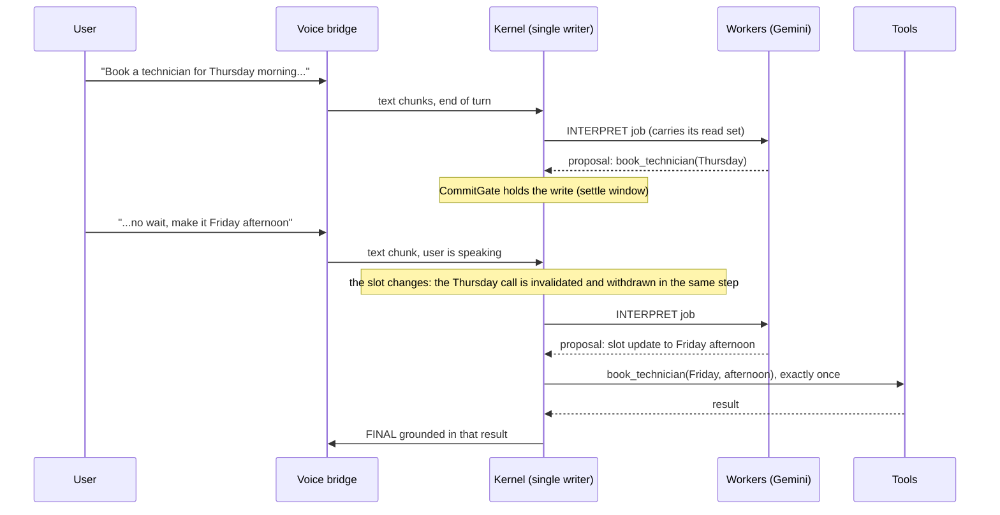
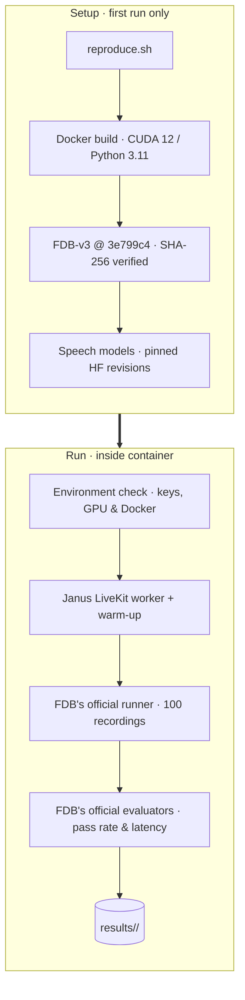
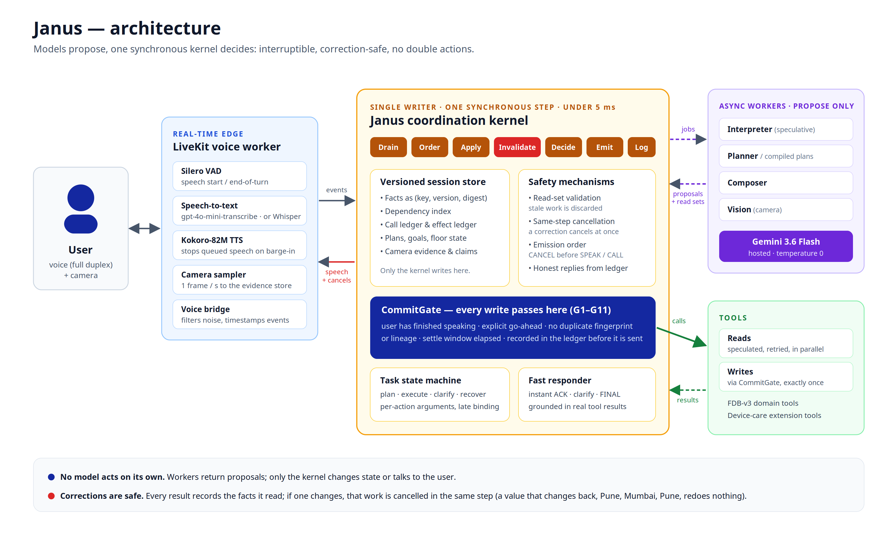
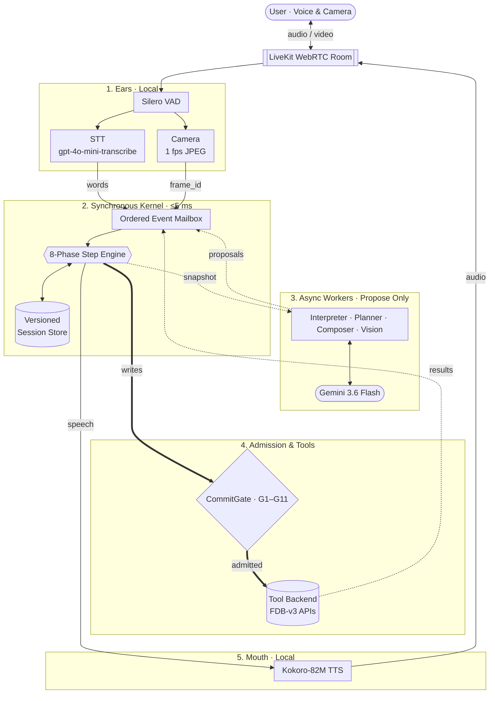
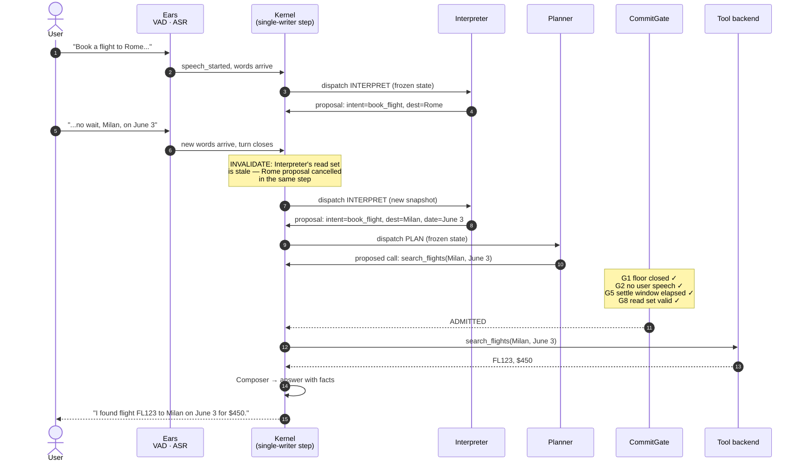
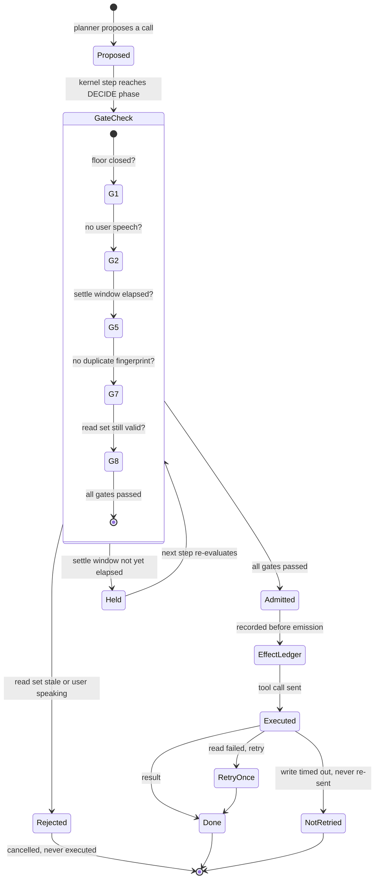
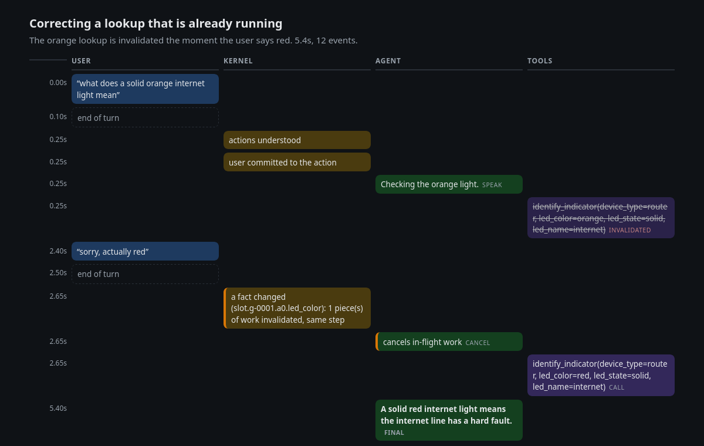
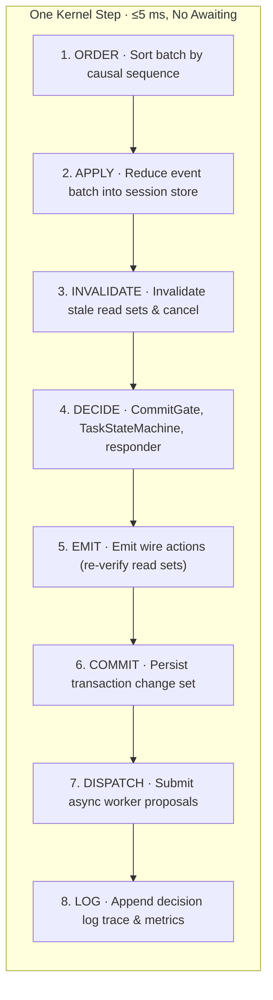
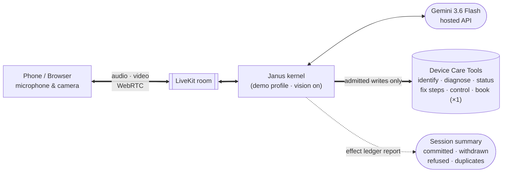
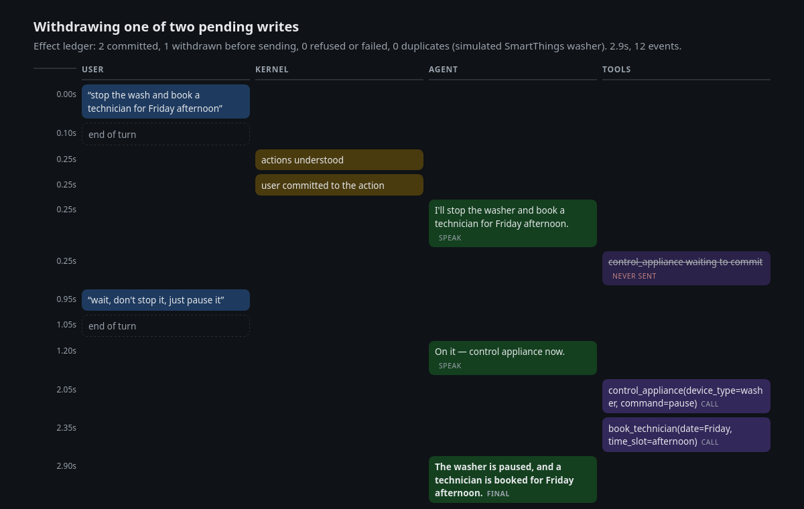

# Janus

**Built for the Samsung R&D Language AI Team by Team AICA**

> **A voice agent you can interrupt, correct and change your mind on, and that still never books twice or claims something it did not do.** No language model ever acts on its own: models *propose*, and one deterministic, replayable kernel *decides*.

Built for the **Samsung PRISM GenAI Hackathon 3rd Edition, Theme 05: Interruptible Real-Time Agents**, and evaluated on **Full-Duplex-Bench v3 (FDB-v3)** over LiveKit.

**Submission files (demo video, slide deck, AI disclosure):** [Google Drive](https://drive.google.com/drive/folders/1qs63uPvp7TtCoOG52TNbP43UYLbaXk3E?usp=drive_link) · Deck and AI disclosure are also in this repo: [`VITVellore_AICA_Submission.pptx`](VITVellore_AICA_Submission.pptx), [`LangAI3.0_AI_Disclosure.docx`](LangAI3.0_AI_Disclosure.docx)

| | |
|---|---|
| **Benchmark** | Full-Duplex-Bench v3 (FDB-v3): 100 real spoken recordings across 4 domains, 12 tools, the official runner and LLM judge |
| **Result** | **74 % strict pass on the full voice path** (73 % on the final re-run), 77 % in text replay; **0.765 Pass@1 on self-correction**, the category that is hardest for every published system |
| **Reasoning core** | Gemini 3.6 Flash via the Google AI Studio API (temperature 0, zero thinking budget); OpenAI GPT-4.1 as a switchable alternate |
| **Speech and vision** | OpenAI `gpt-4o-mini-transcribe` (hosted, pinned snapshot) or local `faster-whisper`, Silero VAD, Kokoro-82M TTS, a 1 fps camera sampler feeding Gemini Vision |
| **Core architecture** | A single-writer synchronous kernel (under 5 ms per step) with read-set invalidation, same-step cancellation, a G1–G11 `CommitGate` and an effect ledger |
| **Use-case extension** | Camera-grounded appliance and device care with Samsung SmartThings-style error handling ([Extension](#extension-camera-grounded-device-care)) |
| **AI disclosure** | [`LangAI3.0_AI_Disclosure.docx`](LangAI3.0_AI_Disclosure.docx) |
| **Reproduction** | One command, [`./reproduce.sh`](#reproduce-the-benchmark-one-command): a pinned Docker build with SHA-256-verified data, run through FDB's own runner and evaluators; **verified end to end on a clean VM: 74 / 100** |
| **Verification** | 645 deterministic tests on a stepped clock, a trace checker over every decision log, byte-identical replay, and an adversarial explorer over 19 race scenarios |

**Highlights**
- **74 % strict pass rate on the full voice path** (all 100 FDB-v3 recordings over LiveKit, judged with gpt-4o), against 60 % for the best published system (GPT-Realtime); 77 % for the reasoning core in text replay. Five full voice runs on 3 and 4 Oct scored 73, 65, 74, 73 and (through Docker) 74; the 65 is explained and fixed (below), and single runs vary by a few points. Every run is recorded in [`BENCHMARKS.md`](BENCHMARKS.md).
- **Self-correction ("…no wait, make it Friday"), the category FDB-v3 finds hardest for every system:** 0.765 Pass@1 on the final voice run, against 0.176 for the published cascaded pipeline (the same family as ours) and 0.588 for GPT-Realtime; 0.824 in text replay.
- **No double actions, no false claims, by construction:** every write passes one commit gate and is recorded in an effect ledger before it is emitted; a correction cancels stale work in the same kernel step; a failed, skipped or withdrawn step is said aloud, never reported as done.
- **It listens before it acts:** the kernel hears that the user is speaking, holds calls and speech until the floor is closed, merges a request split by a pause, and runs only the branch of an "if … otherwise …" request that the real tool result supports.
- **Deterministic and replayable:** 645 tests on a stepped clock with a trace checker over every decision log, plus an adversarial explorer that perturbs timings around 19 race scenarios.
- **Use-case extension:** camera-grounded device care over live voice: it reads the device from the camera, diagnoses it, and books exactly one technician visit.

> **Provider declaration.** Custom LiveKit agent (Janus). Decisions: the Janus kernel with **Gemini 3.6 Flash** (hosted Gemini API, thinking budget 0, temperature 0). Speech-to-text: **OpenAI `gpt-4o-mini-transcribe-2025-12-15`** (hosted, pinned snapshot). Local on the GPU: **Kokoro-82M** (TTS), **Silero VAD**. Nothing else is called at evaluation time. Keys needed: LiveKit, `GEMINI_API_KEY`, `OPENAI_API_KEY` (see [Keys](#keys)). Two switches change the providers: `JANUS_STT=local` runs faster-whisper large-v3-turbo on the GPU instead, and `JANUS_LLM_PROVIDER=openai` moves decisions to OpenAI (see [Keys](#keys)); every run writes the providers it actually used to `PROVIDER.txt`.
> (The Python import path is `prism_rt`; the distribution is named `janus`. That mismatch is deliberate.)

## Contents

1. [Why Janus is built this way](#why-janus-is-built-this-way) · 2. [What is inside](#what-is-inside) · 3. [Reproduce the benchmark](#reproduce-the-benchmark-one-command) · 4. [How Janus works](#how-janus-works) · 5. [How an interruption flows](#how-an-interruption-flows) · 6. [Deep dive](#deep-dive) · 7. [Extension: device care](#extension-camera-grounded-device-care) · 8. [Results](#results) · 9. [Benchmark labels](#benchmark-labels-and-the-published-tools) · 10. [Keys](#keys) · 11. [Tests](#tests) · 12. [Limitations](#limitations) · 13. [Repo map](#repo-map) · 14. [Citations](#citations)

## Why Janus is built this way

**The problem.** Most voice agents are one loop: the model decides, calls a tool, speaks. That loop is fine until the user interrupts. Then it fails in three specific ways: a **race** (the user corrects a value while a lookup is running, and the stale answer is spoken anyway), a **phantom completion** (the agent says "booked" for something that was cancelled or never ran), and a **duplicate side effect** (a retry or a correction books twice). None of these is a prompting problem. They come from letting a model own the state and the side effects.

**The idea.** Models never act. Every language-model call (interpret, plan, bind, compose, vision) is an asynchronous *worker* that returns a **proposal**. One synchronous **kernel** owns all session state and is the only thing that can speak, call a tool or cancel. Each guarantee below is an enforced mechanism with a test, not an instruction in a prompt:

| Guarantee | Mechanism | Where |
|---|---|---|
| A correction cancels stale work **in the same step** it arrives | Every proposal, call and pending utterance records the `(fact, version, digest)` it read; a changed fact invalidates its dependents and the CANCEL is emitted before any new speech or call | `kernel/invalidation.py`, `store/facts.py` |
| A value that changes back (Pune, Mumbai, Pune) redoes nothing | Read sets compare digests, not a generation counter | `canonical.py`, `store/facts.py` |
| No write fires while the user is still talking, before their go-ahead, or inside the settle window | `CommitGate` G1–G11: floor closed, explicit intent (required in the device-care profile), settle barrier, valid read set at emission | `kernel/commit.py`, `kernel/emission.py` |
| No double booking | Fingerprint (G5) and plan-step lineage (G6) checks; the write is recorded in the effect ledger *before* it is emitted | `store/ledgers.py` |
| No false "done" | A final answer is grounded in the results the kernel consumed and truth-checked, with a template fallback; failures, refusals and skipped steps are reported as not done, with `task_completed=false` | `kernel/responder.py`, `workers/composer.py` |
| An action the user ruled out never runs | "If it is under $50 add it, otherwise track my order": the condition is checked against the real result before the step may run; an action the user calls off is left out of the plan | `kernel/binder.py`, `kernel/action_plans.py`, `workers/interpreter.py` |
| Everything is replayable | One synchronous step on an injected clock: the same input gives a byte-identical decision log, a required test | `sim/`, `observability/` |



**Why this is not a benchmark trick.** The same kernel runs the Full-Duplex-Bench voice benchmark and the camera-grounded device-care extension; only a configuration profile differs (`fdb_v3_config`, `demo_config` in `src/prism_rt/profiles.py`). New kernel behaviour is added behind a `Config` flag and covered by tests; the tagged versions V0–V4 and six post-V4 phases each stayed runnable.

**Evidence, not claims**
- **645 deterministic tests** on a stepped clock with a scripted model, and a trace checker that audits every decision log (no event reordering, floor rule, no stale consumption, no false completion claim, one confirmed write per lineage).
- **A bounded adversarial explorer** perturbs tool and worker latencies and user timing around 19 race scenarios, with oracles re-derived from state; its first run found three real kernel bugs, all fixed with regression tests.
- **Independent reviews are logged, not trusted:** every round's findings were reproduced before a fix shipped, and the ones that did not hold up are recorded too ([`reviews/index.md`](reviews/index.md), [`reviews/audit-2026-10-01.md`](reviews/audit-2026-10-01.md)).
- **On the hardest benchmark category** (self-correction), 0.765 Pass@1 on the full voice path, against 0.176 for the published cascaded pipeline of the same family. See [Results](#results).
- A step-by-step tour of the code is in [`docs/architecture_walkthrough.md`](docs/architecture_walkthrough.md).

## What is inside

Everything below is implemented and tested, and active in the benchmark profile unless marked optional.

**The kernel**
- **Single-writer step** (`kernel/step.py`): order, apply, invalidate, decide, emit, commit, dispatch, log. Synchronous, never awaits, under 5 ms by design (about 0.4 ms measured).
- **Optimistic concurrency with read sets:** `(fact, version, digest)` on every proposal, call and utterance, so a correction invalidates exactly the work that read the old value, and a value that reverts redoes nothing.
- **Same-step cancellation** with a fixed emission order (CANCEL before SPEAK, TOOL_CALL, CLARIFY, FINAL).
- **Chunk-anchored cancellation:** a high-confidence corrected value cancels the stale call mid-utterance, before the turn ends.
- **`CommitGate` G1–G11** and an append-only **effect ledger** written before emission: duplicate fingerprints, plan-step lineage, unknown-outcome writes, the settle window and the open-floor rule.
- **Call deadlines and a retry table:** a lost tool result cancels and asks or fails honestly instead of hanging; a write is never re-sent blindly.
- **Honest failure and partial failure:** a failed step is reported, steps that do not depend on it still run, and the completion flag is false.

**Understanding and planning**
- **Compiled per-action plans:** the interpreter returns one entry per tool call with its own arguments, and the kernel compiles the plan in the same step, with no planner round trip.
- **Late binding:** a chained argument ("the cheapest one", "from there") is chosen from the earlier call's real result once it exists, never guessed.
- **Conditional branches:** "if one is under $50 add it, otherwise track my order" runs only the branch the real result supports, and the answer says what was skipped and why.
- **Speculative interpretation:** the interpreter runs on the transcript prefix while the user is still talking and is applied at the end of the turn with no extra latency when nothing material was added; inert tails ("please") are recognised.
- **Independent actions:** a step no longer waits on an earlier one that is waiting for the user, unless it reads that step's result.
- **Assume and say:** an unstated count or budget gets the least restrictive value, said aloud; an unstated city or date is asked for, with the allowed values.
- **Value rules:** spoken amounts and dates, spoken codes ("F A S T nine nine" becomes `FAST99`), a value that is a declared default in another form, and enum-like values in the form the tool implies.

**The voice path**
- **A kernel that hears the floor:** VAD speech start and stop reach the kernel, which holds calls and speech until the user is quiet (`vad_floor_enabled`).
- **Turn ending that follows silence,** waits for every transcription still running, and merges a request split by a mid-sentence pause.
- **Barge-in:** words over the agent stop all queued speech; noise and fillers do not.
- **Hosted or local speech-to-text, Kokoro text-to-speech, Silero VAD,** and one fresh runtime per LiveKit room.

**Multimodal**
- **Camera grounding:** 1 fps frames, a vision worker, perception claims with leases, and conflicts resolved so that what the user said wins over what the camera saw.
- **Claim grades** on what the agent says (understood, intended, result, effect done), so speech cannot outrun the ledger.

**Verification and observability**
- **Replay identity,** a **trace checker** over every decision log, a **bounded adversarial explorer** with minimisation, and independent reviews logged together with the findings that did not hold up.
- **A per-step decision log** (events, fact changes, invalidations, gate rejections, dispatches) and the **X-ray** page drawn from it.
- **Reproducibility:** a pinned Docker image, FDB at a pinned commit with a checksummed dataset, a run manifest with versions and seeds, a native fallback, and every run archived in the repo.

**Built, flag-gated and off in the benchmark profile:** C2 response frames (a kernel-rendered final answer with no compose round trip), C9 commit-last ordering, and reference-bound write identifiers.

## Reproduce the benchmark (one command)

```bash
cp .env.example .env      # fill in the keys, see "Keys" below
./reproduce.sh            # all 100 scenarios, FDB's LLM judge on
```

Needs Docker with the NVIDIA container toolkit, an NVIDIA GPU (measured peak about 10 GB VRAM; the image carries the CUDA 12.6 build of PyTorch, so any driver 525 or newer, on Ampere, Ada or Hopper GPUs: RTX 30 and 40 series, A100, A6000, L40S, H100), about 40 GB of disk and internet access.

**Verified on a clean machine.** The pinned image was built from scratch and `./reproduce.sh` ran on a fresh Ubuntu 24.04 VM with an RTX 3090 and Docker 29: the GPU is visible inside the container, FDB is fetched at its pinned commit, and FDB's own runner and evaluators produce `results/<timestamp>/`. A 5-recording run completed with the same pass count as the native path on the same code, and then the **full 100-recording judged run through `./reproduce.sh` scored 74 / 100** (tool selection 0.964, argument accuracy 0.807, response quality 0.69, first word 7.1 s, no client aborts, no API errors), in line with the native runs (73 to 74 %). Running the script twice in one checkout is safe too (a second run used to stop on git's ownership check; fixed).

What it does, in order:

1. Checks the environment (never prints key values), Docker, and that the GPU is visible inside the container.
2. Builds the pinned image `docker/fdb_v3/Dockerfile`. Whisper, Kokoro and FDB's Parakeet scoring ASR are baked in at pinned Hugging Face revisions, so nothing downloads mid-run.
3. Inside the container: clones FDB at commit `3e799c45…`, downloads its data and **verifies the sha256** before extracting.
4. Starts the Janus LiveKit worker, then runs **FDB's own runner** (`run_tool_benchmark_all_released.py --provider janus`) and **FDB's own three evaluators**, with `--use-llm`.
5. Writes `results/<timestamp>/`: `pass_rate_report.json`, `tool_calls_report.json`, latency report, per-room decision logs, `agent.log`, `manifest.json` (commit, package versions, the full profile, seeds, judge on/off), `PROVIDER.txt`, `SUMMARY.md`.

<!-- DIAGRAM FIX (teammate), delete this comment when done:
  - Setup flowchart: the speech models are baked into the image at build time, before FDB is cloned; show them inside the Docker build step (or reorder) instead of after the FDB node.
  - Optionally add the options (--ids, --skip-build, --no-judge) on the reproduce.sh node.
-->


Options: `--ids "travel_01 finance_19"` runs a quick smoke test, `--no-judge` scores by exact match only, `--skip-build` reuses the image (the repo is mounted into the container, so a code change needs no rebuild), `--low-vram` is a workaround for GPUs under 16 GB.

Seeds and randomness: the model call uses temperature 0 and the kernel is deterministic given its inputs (replay identity is a tested invariant). FDB's own mock-tool latency jitter is unseeded and a hosted model is not bit-reproducible, so two runs differ slightly. That is recorded in `manifest.json`, not hidden.

**Native fallback (no Docker).** On a Linux box with an NVIDIA GPU and root but no container runtime: `bash scripts/fdb_v3/native_setup.sh` (Python venv, PyTorch for CUDA 12.6, the pinned speech stack, a GPU check), then `scripts/fdb_v3/native_run.sh [--ids "travel_01 finance_19"]`. `native_run.sh` reads the same `.env` and runs exactly the `repro_inner.sh` that runs inside the container; the LLM judge is off unless `--judge` is passed.

## How Janus works



<!-- DIAGRAM FIX (teammate), delete this comment when done:
  - Rename the subgraph '1. Ears · Local' to '1. Ears': speech-to-text (gpt-4o-mini-transcribe) is HOSTED (OpenAI); only Silero VAD is local. Mark the STT node 'hosted (or local Whisper)'.
  - Edge 'VAD --> CAM' is wrong: camera frames do not come from VAD. Change it to 'ROOM --> CAM'.
  - Workers node: write 'Interpreter · Binder · Composer · Vision (Planner as fallback)'. In the benchmark profile the interpreter's per-action list is compiled into the plan in the same kernel step; there is no PLAN round trip.
  - Step-engine node says '8-Phase'; pick one count and use it in every diagram (the spec names 7 phases: drain, order, apply, invalidate, decide, emit, log; the code splits out commit and dispatch, giving 8; the architecture PNG shows 7 chips).
  - Tools node says 'FDB-v3 APIs' only: add 'and device-care tools' (the extension).
  - Optional: add the voice bridge between the ears and the mailbox (it turns VAD and transcript events into kernel events and closes the turn).
-->


- **The ears** turn the room audio into words and sample video frames. They never decide what to do. A voice bridge turns speech start and stop, transcripts and barge-ins into kernel events, and closes a turn only after the user's silence *and* every transcription still running.
- **The kernel** owns every action in a single synchronous step (under 5 ms by design). No model, no worker and no tool ever changes state directly; they can only return *proposals*, which the kernel validates against read sets and the `CommitGate`.
- **The workers** run outside the kernel (an Interpreter, a Binder that picks chained arguments from real results, a Composer, a Vision worker, and a Planner as a fallback) and can only *propose*. If the user's words changed while a worker was thinking, the kernel invalidates its proposal in the same step. Workers never import the kernel.
- **The tools** only receive calls that passed every `CommitGate` rule, and a write is recorded in the effect ledger *before* it is emitted, so it never executes twice.

The three rules everything else follows from:

- **Single writer.** One synchronous kernel step owns all state. Interpretation, planning, composing, vision and ASR run as async workers outside it and can only return *proposals*. The kernel never awaits inside a step, and all timing goes through a clock port, so runs are replayable byte for byte.
- **Optimistic concurrency with read sets.** Every proposal, call and pending utterance records the `(fact, version, digest)` it depended on. If any of them changed, the work is stale and is cancelled *in the same step*; if a value reverts (Pune → Mumbai → Pune) the digest matches again and nothing is redone.
- **Reads and writes are different.** Reads can be speculated, retried and run in parallel. A write passes one `CommitGate` (floor closed, explicit user intent, no duplicate fingerprint or lineage, the settle window elapsed) and is recorded in the effect ledger *before* it is emitted. That is what prevents a double booking.


### One turn, with a self-correction

<!-- DIAGRAM FIX (teammate), delete this comment when done:
  - Gate labels are wrong. Real gates (src/prism_rt/kernel/commit.py): G1 tool usable, G2 read set valid, G3 floor closed / user not speaking, G4 explicit commit intent, G5 no duplicate fingerprint, G6 no duplicate plan-step lineage, G7 no unknown-outcome effect, G8 arguments valid, G9 read set re-checked at emission (EmissionGate), G10 settle window elapsed, G11 no new turn open. The note currently says 'G1 floor closed, G2 no user speech, G5 settle window elapsed, G8 read set valid'. Replace with e.g. 'G3 floor closed and user quiet / G2 read set valid / G5 no duplicate'.
  - Remove the Planner participant and the 'dispatch PLAN' steps: replace with 'Kernel compiles the plan from the interpretation (same step)'.
  - search_flights is a read, so G4 and G10 do not apply to it by default; if you want the settle window in the picture, use a write such as book_flight(Milan, June 3).
  - 'Kernel->>Kernel: Composer → answer with facts' should be 'Kernel->>Composer: COMPOSE job', 'Composer->>Kernel: proposal: answer text', then the kernel emits FINAL.
-->


Had the user spoken again at step 12 ("...actually, June 4"), the Rome-era plan would already be gone, and the Milan plan's read set would be stale the moment the new words arrive: invalidated and never executed. The next step re-reads everything and plans again. A cough or room noise, which brings no new *words*, only delays the call, because the kernel is told that the user is audibly active.

### The CommitGate: when a write may run

<!-- DIAGRAM FIX (teammate), delete this comment when done:
  - Gate numbers/names are wrong; use the real ones: G1 tool usable, G2 read set valid, G3 floor closed + user not speaking, G4 commit intent, G5 no duplicate fingerprint, G6 no duplicate lineage, G7 no unknown-outcome effect, G8 args valid, G10 settle window elapsed, G11 no new turn open; G9 (read set valid at emission) is checked by the EmissionGate, after Admitted.
  - 'user speaking' must go to HELD, not Rejected: the call waits and goes out once the floor closes. Only a stale read set (G2/G9) or invalid arguments (G8) are rejected.
  - RetryOnce: the policy is a bounded retry for reads and none for writes in the benchmark profile (max_read_retries=0, max_write_retries=0). Say 'bounded retry (reads)' rather than 'retry once'.
-->


Every call passes the same ordered rules (`kernel/commit.py`, `kernel/emission.py`):

| Gate | Rule | If it fails |
|---|---|---|
| G1 | the tool exists and is usable | the goal fails honestly (never a silent livelock) |
| G2 | the call's read set is still valid | the call is stale and cancelled |
| G3 | the floor is closed and the user is not speaking | held until they stop |
| G4 | the user has given explicit intent (required in the device-care profile) | asked: "Shall I go ahead and book…?" |
| G5 | no duplicate fingerprint (tool plus canonical arguments) | blocked; an honest "already done" |
| G6 | no existing effect on the same plan-step lineage | blocked; the answer names what already went through |
| G7 | no write with an unknown outcome on the lineage | the user is asked before any retry |
| G8 | the arguments match the tool's schema (a blank required value is refused) | asked again, or the step fails honestly |
| G9 | the read set is still valid *at emission* (checked by the emission gate) | withdrawn before it is sent |
| G10 | the settle window has elapsed (1 s in the benchmark profile, 2.5 s while the user is mid-sentence) | held, so a late correction can still cancel it |
| G11 | no new user turn is open | held |

| Mechanism | What it guarantees |
|---|---|
| **Single writer** | One synchronous kernel step owns all state. Workers, models and tools can only *propose*; nothing changes without the kernel's admission. No awaiting, no locks, no races. |
| **Read sets** | Every proposal records `(fact, version, digest)`. If any fact changed, the work is stale and is cancelled *in the same step*. If a value reverts (Pune → Mumbai → Pune), the digest matches and nothing is redone. |
| **CommitGate (G1–G11)** | A write runs only after the floor closes, the user has been quiet for the settle window (longer when they are revising or mid-sentence), there is no duplicate fingerprint or lineage, and the read set is still valid at emission. |
| **Effect ledger** | Every admitted write is recorded *before* it is emitted. A state-changing action never executes twice, even if the user barges in mid-call. |
| **Failure policy** | Reads have a bounded retry; a failed or timed-out write is never blindly re-sent. The user is told what happened, and an ambiguous outcome is asked about, not guessed. |
| **Keep listening** | When the words are cut off mid-sentence or announce a detail still coming ("the order number is…"), the kernel extends the settle window to 2.5 s: nothing is said or done until the user has been quiet that long. |
| **Deterministic replay** | All timing goes through a clock port. The kernel is replayable byte for byte on a stepped clock; 645 tests verify this with a trace checker over every decision log. |

The full architecture specification is in `docs/prompt 2.txt`, and a guided tour of the code is [`docs/architecture_walkthrough.md`](docs/architecture_walkthrough.md).

## How an interruption flows

The kernel X-ray draws a session from its decision log: what the user said, what the kernel understood, what it held back, and which work it invalidated. Struck-through work never took effect.



*The user asks about an orange light, and 2.4 s later says "sorry, actually red". The orange lookup is invalidated and cancelled in the same kernel step the correction arrives, and re-run with red. One final answer, grounded in the red result.* Interactive versions: [`docs/xray/correct_a_running_lookup.html`](docs/xray/correct_a_running_lookup.html), [`docs/xray/correct_before_booking.html`](docs/xray/correct_before_booking.html), and for the extension [`docs/xray/withdraw_one_of_two_writes.html`](docs/xray/withdraw_one_of_two_writes.html) (two writes pending, a correction withdraws one before it is sent; drawn as a struck "never sent" row). Regenerate with `PYTHONPATH=src:. python scripts/make_xray.py`; a live session writes its own logs when `JANUS_DECISION_LOG_DIR` is set, and `python -m prism_rt.observability.xray DECISIONS.jsonl WIRE.jsonl out.html` draws them.

## Deep dive

### Anatomy of one kernel step

<!-- DIAGRAM FIX (teammate), delete this comment when done:
  - Step diagram: P7 text should read 'DISPATCH · start the worker jobs that DECIDE requested' (workers return proposals later, as events). Decide whether to show 'Drain' as phase 0 so the diagram matches the 7-phase spec and the architecture PNG.
  - P1 can read 'ORDER · sort the batch by (timestamp, event class, sequence)'.
-->


`Kernel.step(batch)` in `kernel/step.py` never awaits and runs these phases in this order. Everything after the first two sees the state the previous phase left behind.

| # | Phase | What happens |
|---|---|---|
| 1 | Order | The batch is sorted by `(timestamp, event class, sequence)`, so the same events always replay the same way |
| 2 | Apply | One reducer per event writes facts: speech chunks, tool results, worker proposals, user-speech activity, camera frames |
| 3 | Invalidate | Changed fact keys are walked through the dependency index; every call, job and proposal that read one is marked stale in this same step |
| 4 | Decide | Components run in a fixed order: cancellations, call deadlines, late binding, the task state machine, perception, ASR, response frames, the plan executor, the CommitGate, and the fast responder |
| 5 | Emit | The emission gate re-checks each action's read set (G9), orders them CANCEL, SPEAK, TOOL_CALL, CLARIFY, FINAL, and stamps them. A correction's cancel always leaves before its replacement |
| 6 | Commit | The transaction commits and the change set is produced |
| 7 | Dispatch | The worker jobs that Decide requested are actually started |
| 8 | Log | One decision-log line per step: events, fact changes, invalidations, gate rejections, emissions, dispatches |

A step takes well under a millisecond in practice (0.4 ms measured over 200 turns; the design target is 5 ms), so the kernel is never the slow part.

### Interruption cases the kernel handles

Each row is a situation that breaks a loop-based agent, what Janus does, and the test that pins it.

| Situation | Behaviour | Test |
|---|---|---|
| The user corrects a value while a lookup is running | The lookup is invalidated and cancelled in the same step, re-run with the new value, and only the new answer is spoken | `test_correction_race_regression.py`, `test_v2.py` |
| A correction arrives mid-utterance | A high-confidence corrected value cancels the stale call as soon as it is heard, not at the end of the turn | `test_phase4.py` |
| The user changes a booking before it is sent | The write waits in the settle window and is withdrawn; the ledger records "never sent" | `test_v2.py`, `test_devicecare.py` |
| The user changes a booking after it went through | Janus says so and refuses a second booking; it never claims the first was changed | `test_write_lineage_regression.py` |
| A tool fails past its retry limit | An honest failure, `task_completed=false`; never a "done" | `test_failure_honesty_regression.py` |
| A write's result arrives after the user cancelled it | The result router reconciles it and the answer tells the truth about what went through | `test_v2.py`, `test_write_lineage_regression.py` |
| One action in a plan fails | The failure is recorded; actions that do not depend on it still run; the answer lists what was not done | `test_s3_action_plans.py`, `test_multi_action.py` |
| A request is split by a mid-sentence pause | The two halves are interpreted once, together | `test_merge_split_turns.py` |
| The user is still speaking when a call is ready | The call and the speech are held until the floor is closed | `test_vad_floor.py`, `test_cs28_floor_rule.py`, `test_triage_hold.py` |
| "If one is under $50 add it, otherwise track my order" | Only the branch the real result supports runs, and the answer says what was skipped | `test_conditional_actions.py` |
| "Show me the cheapest one, then add it" | The chained value is chosen from the real result after it exists, never guessed | `test_s3_late_binding.py` |
| A required detail is missing | Janus asks, with the allowed values, or re-reads the request once before asking | `test_clarify_wake.py`, `test_s2_quickwins.py` |
| The user speaks over the agent | Queued speech stops; a barge-in with no recognised words still closes its turn | `test_voice_bridge.py`, `test_voice_bridge_kernel_barge_in.py` |
| A tool result never comes back | A call deadline cancels it and the goal asks or fails instead of hanging | `test_p0_4_call_deadlines.py` |
| The camera shows what the user did not say | A vision claim fills the missing value, and a user-stated value always wins over the camera | `test_v3.py`, `test_multimodal_races.py` |

### From sound to a decision (the voice path)

1. **LiveKit** carries the user's microphone and camera into the worker (`src/prism_rt/voice/agent.py`). Nothing language-model-related lives in the session: every utterance and tool call comes from the kernel.
2. **Silero VAD** marks speech start and stop. The **voice bridge** (`adapters/voice_bridge.py`) turns those into kernel events and closes a turn only after the user's silence has run its course *and* every transcription still in flight has delivered its text.
3. **Speech-to-text** is hosted (`gpt-4o-mini-transcribe`, pinned snapshot) by default, or faster-whisper on the GPU. Each segment is transcribed after a pause; the transcriber reports when each transcription starts and finishes so the bridge never closes a turn on half a sentence.
4. The kernel receives `text_chunk`, `user_speech` and `end_of_turn` events and decides. Workers (Gemini) interpret, bind, plan and compose; **Kokoro-82M** speaks only what the kernel emits.
5. A **speculative interpretation** starts on the transcript so far while the user is still talking, and is used at the end of the turn with no extra latency when nothing material was added.

### Design decisions and trade-offs

| Decision | Why | Cost |
|---|---|---|
| One synchronous writer instead of a concurrent agent loop | Races become impossible by construction and every run is replayable | Workers can only propose, so every LLM result waits for the next step |
| The turn closes after 1.5 s of silence in the benchmark runs | Closing earlier split requests in the benchmark audio and cost accuracy (a 65 % run before the fix) | About 1.5 s of added time to the first word |
| Writes wait out a settle window | A late "no wait, Friday" can still cancel the write | About 1 s before a booking goes out |
| Hosted speech-to-text, not streaming | Far better on accents and names than the small local model | Transcription lands after the pause; first word is about 8.5 s on the benchmark |
| Follow the published tool contract, not the benchmark's labels | An agent that sends arguments a tool does not declare, or invents a value, is wrong in a real product | Some recordings fail by design (see [Benchmark labels](#benchmark-labels-and-the-published-tools)) |
| Every new behaviour behind a `Config` flag | Any tagged version stays a safe fallback | More flags to document |
| Honest failure over a confident guess | A failed or skipped step is said aloud; a missing detail is asked | Sometimes one more question than a guessing agent |

### Two profiles, one kernel

| Setting | `fdb_v3_config` (benchmark) | `demo_config` (device care) |
|---|---|---|
| Action plans, split-turn merge, speculative interpretation | on | on |
| `vad_floor_enabled` (the kernel hears that the user is speaking) | on | off (no echo cancellation in a live room) |
| `conditional_actions_enabled`, `partial_failure_continues`, `parallel_independent_actions` | on | on |
| `vision_enabled` (camera frames answer questions) | off | on |
| `fill_unstated_required_enabled` (assume a count or budget, say it aloud) | on | off: a missing date or slot is asked |
| Write needs the user's explicit go-ahead | exempt (the benchmark's tools declare no mutability) | required |
| Whole-session watchdog | 105 s | none |

### What we found by looking at real audio

The kernel's correction machinery had been proven on deterministic tests and had never run on real speech, so the project audited its own voice runs:
- **The main loss was not reasoning.** The voice bridge closed the user's turn while they were still talking, because hosted transcripts arrive about a second late and re-armed the timer. That split 52 of 72 recordings; the fix (turn-ending follows VAD silence, the kernel hears the floor) took a 26-recording check from 12 to 16 passes with no early closes.
- **A second cause showed up on a slow day.** Hosted transcription of long sentences took 4–10 s, 19 turns closed before their last sentence arrived, and a run scored 65 %. The transcriber now reports when it starts and finishes, and a turn stays open while one is running; the next full run scored 74 %.
- **Each finding became a regression test** that fails without its fix. The audit, with the status of every finding, is [`reviews/audit-2026-10-01.md`](reviews/audit-2026-10-01.md); every run and every failure is in [`BENCHMARKS.md`](BENCHMARKS.md).

### Where this goes

Design directions, not shipped or tested on a device:
- **On-device hybrid.** The kernel is small, deterministic and runs in well under a millisecond per step, so it could sit next to voice-activity detection on a phone or a TV while heavy vision and reasoning stay in the cloud. Nothing here has been run on a Samsung device.
- **Real device backends.** The extension's device adapter is replaced through the tool manifest; the coordination layer above it (corrections, commit gate, effect ledger) is unchanged. A SmartThings integration is the natural first step.
- **Streaming transcription** so prefix speculation and mid-utterance cancellation engage on real audio, not only in the deterministic tests. This is the largest latency and accuracy lever left.
- **A faster first-step model** for interpretation, and a build that picks its CUDA version from the GPU.

### FAQ

**Why not let the model call tools directly?** Because then a correction, a retry and a slow tool can all act on the same state at once. The kernel gives one place where "is this still true?" is decided, and a model that proposes without being able to act cannot double-book.

**Isn't one synchronous step a bottleneck?** The step takes well under a millisecond; the waits are model calls and speech, which run outside it. The kernel is the part that is always fast.

**What stops the agent saying "done" when it was not?** The final answer is built from results the kernel consumed. A step that failed, was skipped or was withdrawn is reported as not done and the goal's completion flag is false.

**Does it work without the benchmark?** Yes: the extension runs the same kernel with a different profile, over live voice and camera, with a simulated device backend.

**Is the score reproducible?** The scoring is FDB-v3's own runner and evaluators at a pinned commit through `./reproduce.sh`. A hosted model is not bit-reproducible, so single runs vary by a few points (three full runs on 3 Oct scored 73, 65 and 74).

### Glossary

- **Read set:** the list of `(fact, version, digest)` a proposal, call or utterance depended on. Valid while every fact still exists with the same digest.
- **Settle window:** the short wait before a write is sent, so a late correction can still cancel it.
- **Floor:** whether the user currently holds the turn (speaking, or their words still being transcribed).
- **Effect ledger:** the append-only record of every write, entered before the write is emitted.
- **Compiled plan:** the list of tool calls the interpreter returned, turned into a plan in the same step, with each call's own arguments.
- **Late binding:** choosing a chained argument ("the cheapest one") from the earlier call's real result after it exists.
- **X-ray:** the page drawn from a decision log that shows what was said, understood, held back and invalidated.

## Extension: camera-grounded device care

**This is the use-case extension.** A user points a phone camera at a device and talks to it. Janus reads the frame, looks the problem up, gives the fix steps, and books **exactly one** technician visit, even if the user changes their mind mid-sentence.

<!-- DIAGRAM FIX (teammate), delete this comment when done:
  - Extension flowchart: rename node id GEMMA to GEMINI (the label already says Gemini 3.6 Flash); the edge 'admitted writes only' should be 'admitted calls (writes via the CommitGate)'; optionally add the camera sampler and the vision worker as nodes.
-->


```
"My router has a blinking light that is not green. What does it mean?"
   camera frame -> vision: led_color=orange, led_name=internet   (the user never said which light)
   -> identify_indicator(router, orange, blinking, internet)
"The orange internet light means the router cannot reach the internet ..."
"Okay, how do I fix it?"                          -> get_fix_steps  (the diagnosed case)
"Book a technician for Thursday morning ... no wait, make it Friday afternoon."
   -> the Thursday request is superseded before anything is booked
   -> book_technician(Friday, afternoon)  x1
"Your technician is booked for Friday afternoon."
```

- **Tools** (mock services over a small local knowledge base, `src/prism_rt/devicecare/`): `identify_indicator`, `lookup_error_code`, `get_fix_steps`, `check_warranty`, `get_device_status` (reads) and `book_technician`, `open_support_ticket`, `control_appliance` (writes). Two devices: a Wi-Fi router (LED patterns) and a Samsung-style washing machine (Samsung's published error codes 4C, 5C, UB and dC, and a status shaped like a SmartThings washer, so it also works audio-only).
- **What is real and what is simulated.** Real: speech in and out, turn-taking, the camera frames, the reasoning and vision model, and the Janus kernel (corrections, commit gate, effect ledger). **Simulated: the device backend** (SmartThings-style status and control) **and the Samsung Care booking and ticket services.** Nothing here calls a Samsung API; the device adapter is replaceable through the tool manifest, and the contribution is the coordination layer above it.
- **Effect ledger.** At the end of a demo run (and in the worker's log when a voice session ends) the kernel reports what the session did to the world: writes committed, writes withdrawn before they were sent, writes the device or service refused, and duplicates (always 0). A command the washer refuses ("resume" while it shows 4C) is reported as refused, never as done.
- **Same kernel, different profile.** `demo_config()` in `src/prism_rt/profiles.py`: vision on, tool mutability declared by the manifest, a booking needs the user's explicit go-ahead and waits out the settle window, missing details are asked about instead of assumed.
- **Conversation safeguards**, each from a live session and each with a regression test:
  - A booking without a clear go-ahead is not made in silence: the agent asks *"Shall I go ahead and book technician (Friday, afternoon)?"* and a yes supplies the go-ahead.
  - A change after a booking went through is never re-run as a second booking: *"That's already done — book technician (Thursday, morning) went through. I can't change it from here, and I won't make a second one."* A new request for the same kind of booking asks first and names the one that already stands.
  - A device command the manifest declares `repeatable` (`control_appliance`) is a new command in each request: "stop" after "resume" runs, while a repeated booking is still asked about first. While the agent waits for a yes to "shall I go ahead?", the 15 s stall safety net stays quiet.
  - A missing detail is asked with its allowed values (*"What's the time slot: morning, afternoon or evening?"*), and the camera can answer a question the plan already asked.
  - A question about something an earlier result said (*"What's my router's name?"*) is answered from that result; a request no tool covers is declined honestly, with what the agent can do instead.
- **Camera.** The worker samples the room's video track at about 1 frame per second into JPEGs (`src/prism_rt/voice/camera.py`). The kernel only sees a `frame_id`; the vision worker resolves the bytes.

The washer story, same safeguards:

```
"My washing machine stopped in the middle of a wash. What's wrong with it?"   -> get_device_status: paused, error 4C
"How do I fix it?"                                                          -> tap, inlet hose, inlet filter
"Can you resume the wash?"   -> the washer refuses (4C still showing); the agent says so, nothing is claimed done
"Okay, then stop the wash."  -> a second command to the same washer: a new command, not a repeat; it stops
"Open an urgent ticket and book a technician for Friday afternoon ... no wait, Saturday morning."
   -> one ticket, one booking, Saturday morning; Friday is never booked
   Effect ledger: 3 committed, 1 refused, 0 duplicates
```



Run it:

```bash
# 1. Text + camera image, live Gemini (fastest way to see it); --story router (default) or washer:
PYTHONPATH=src:. python demo/run_device_care_demo.py [--story washer] [--image photo.jpg] [--trace]

# 2. Voice + real camera, in a browser: start the worker in demo mode ...
JANUS_MODE=demo JANUS_STT=openai JANUS_DECISION_LOG_DIR=run_output/demo python -m prism_rt.voice.agent start
#    ... make a token that asks for the demo agent by name ...
python scripts/make_demo_token.py
#    ... and join from the LiveKit Agents Playground (https://agents-playground.livekit.io,
#    manual connect: paste the URL and token), enable microphone and camera, and talk.
#    The demo worker registers as "janus-demo" and joins only rooms that ask for it, so it
#    never takes a benchmark room on the same LiveKit project. Hosted transcription
#    (JANUS_STT=openai) copes better with accents; use headphones so the agent does not
#    hear itself.
```

A step-by-step guide for running it on a laptop (no GPU needed), with the lines to say, is [`docs/demo_guide.md`](docs/demo_guide.md); the router image the camera reads is `demo/router_panel.png`. Tested without a network in `tests/test_devicecare.py`; the camera pump was checked against LiveKit Cloud with a synthetic video track.

## Results

All numbers below are FDB-v3's own runner and evaluators, unmodified, at the pinned commit, with `gpt-4o` as the LLM judge. **Run logs, reports, configuration and seeds of the voice runs are in [`docs/runs/`](docs/runs/)** (audio left out); the headline numbers are summarised in `docs/measurements.md`.

| Setting | Strict pass rate (Pass@1) | Tool selection | Argument accuracy | Response quality |
|---|---|---|---|---|
| **Janus, text replay** (reasoning & safety core), all 100 scenarios, Gemini 3.6 Flash | **77.0 %** | 0.959 | 0.807 | 0.840 |
| **Janus, voice over LiveKit, all 100 recordings, final code, hosted speech-to-text, cloud RTX 3090, native path (3 Oct, evening)** | **74.0 %** (68 / 100 exact-match) | 0.959 | 0.780 | 0.720 | judged; turn-taking 100 / 100; first word 8.5 s mean; no client aborts; [report](BENCHMARK_FULL100_FINAL_2026-10-03.md) |
| Janus, voice, all 100 recordings, current code after the conditional-branch, filter-update and value-form fixes, native path, cloud RTX 3090 (4 Oct) | 73.0 % | 0.953 | 0.767 | n/a: the judge's OpenAI quota ran out for 53 of 100 response-quality scores; pass/fail and argument scoring were unaffected | judged; turn-taking 100 / 100; first word 7.5 s mean; no client aborts; [archive](docs/runs/janus_fdbv3_voice_full100d_2026-10-04.tgz) |
| **Janus, voice, all 100 recordings, through `./reproduce.sh` in Docker on a clean Ubuntu 24.04 VM, RTX 3090 (4 Oct)** | **74.0 %** | 0.964 | 0.807 | 0.690 | judged; turn-taking 100 / 100; first word 7.1 s mean; no client aborts, no API errors; [archive](docs/runs/janus_fdbv3_voice_docker100_2026-10-04.tgz) |
| Janus, text replay, all 100 scenarios, same code (4 Oct) | 76.0 % | | | judged; two recordings pass that did not (type-noun rule) and two that passed by running both branches of a conditional now differ from their labels by design |
| Janus, voice, all 100 recordings, same box and providers, before the 3 Oct fixes (3 Oct, morning) | 73.0 % (68 / 100 exact-match) | 0.947 | 0.768 | 0.626 | judged; turn-taking 99 / 100; first word 8.1 s mean; [report](BENCHMARK_FULL100_2026-10-03.md) |
| Janus, voice, all 100 recordings, an intermediate commit, while hosted speech-to-text was slow (3 Oct, afternoon) | 65.0 % | 0.917 | 0.704 | 0.616 | judged; 19 turns closed while their last sentence was still being transcribed (cause below, fixed) |
| Janus, **voice** over LiveKit, all 100 recordings, cloud RTX 3090, native path (29–30 Sep, before the fixes below) | 42.0 % | 0.844 | 0.611 | 0.597 |
| Janus, **voice**, 32-recording rerun of that run's hardest recordings, after the speech-to-text GPU fix | 11 / 32 (was 8 / 32) | | | exact-match; turn-taking 32 / 32 (was 72 %); first word 7.8 s mean |
| Janus, **voice**, current code with hosted speech-to-text, on recordings the full run failed (30 Sep) | 13 / 31 (the same recordings: 4 / 30 in the full run) | | | judged; turn-taking 64 / 64 |
| Janus, **voice**, current code (2 Oct, local speech-to-text), 26 recordings including the earlier turn-splitting failures | 16 / 26 (the same recordings: 12 / 26 on 30 Sep) | | | exact-match; turns cut off mid-sentence: 0 (31 on 30 Sep); judge not run |
| Published FDB-v3 baselines (paper, Table 2): GPT-Realtime / Gemini Live 3.1 / Cascaded | 60.0 % / 54.0 % / 45.0 % | 0.876 / 0.817 / 0.803 | 0.680 / 0.588 / 0.562 | 0.792 / 0.718 / 0.600 |

Notes on the table:

- The **text-replay** row feeds each recording's ground-truth transcript straight to the kernel. It measures the reasoning and safety core, not speech recognition, turn-taking or latency, so it is *not* comparable to the voice-native baselines on those.
- The **full voice run** is the real audio path. Its decision logs showed the gap was mostly infrastructure, and each cause is now fixed with a regression test:
  - Speech-to-text silently fell back from GPU to CPU in every job process started after the first ~75 recordings, so the agent heard users ~29 s late. It is now logged, GPU memory is recorded, and the fallback can be made fatal.
  - A kernel liveness bug left a clarifying question undispatched when no other event arrived.
  - The stall timeout could fire while the user was still speaking.
  - Whisper's silence hallucinations ("you", "Hmm.") were taken as turns.
  - The voice bridge restarted its end-of-turn timer whenever a transcript arrived. Hosted transcription lands about a second after its segment, usually after the user had resumed, so turns were closed mid-sentence (86 early closes across 52 of 72 recordings). End-of-turn now follows the user's silence, waits for outstanding transcripts, and the kernel is told when the user is speaking. On 26 recordings re-run on 2 Oct: 0 early closes (31 before) and 16 passes (12 before).
  - Spoken codes ("F A S T nine nine") were not joined into identifiers.
  - (3 Oct) The bridge gave up on an outstanding transcript after a fixed 4 s. On a day when hosted transcription of long sentences took 4–10 s, 19 turns closed before their last sentence arrived and the request was split (65 %). The transcriber now reports each transcription's start and finish, and a turn stays open while one is running (up to 15 s). On the final run: 0 such closes, 74 %.
  
  Eight recordings were also lost to the benchmark client itself aborting after the stream; our decision logs show correct tool calls in six of them. The full voice run was repeated with these fixes on 3 Oct (the first row above: 32 recordings fixed, 1 regressed, against 30 Sep; part of the gain is the move to hosted speech-to-text); [`BENCHMARKS.md`](BENCHMARKS.md) lists every run, which comparisons are like for like, and what each failure was.
- **Turn-taking and latency** on the post-fix rerun: the agent responded in all 32 recordings; mean time to its first word was 7.8 s (median 6.7 s). Published first-word means (paper Table 6): GPT-Realtime 6.36 s, Gemini Live 3.1 3.95 s, the cascaded pipeline 8.78 s. Part of ours is deliberate: a turn closes after 1.5 s of silence, and a call waits a settle window so a correction can still land.
- By domain (text replay): finance 100 %, travel 95 %, e-commerce 83 %, **housing 35 %**. Housing is the weakest domain for every published system too; ours fails mostly on argument values in long, constraint-heavy requests.
- **Self-correction** ("…no wait, make it Friday") is the category the paper finds hardest for every system (Table 3, Pass@1 per category: GPT-Realtime 0.588, Gemini Live 3.1 0.353, the cascaded Whisper pipeline 0.176). It is what the kernel is built for: **0.824** in text replay, and **0.765** on the final voice run (0.412 on the 30 Sep run), against 0.176 for the published cascaded pipeline, the same family as ours.
- **After the final voice run (4 Oct, text replay only):** conditional requests run only the branch the tool result supports, and a request to change a saved filter calls the filter tool. Full judged text replay: 76 / 100 (77 before); finance_06/10 newly pass, finance_20 and travel_20 now differ from their labels by design (see [Benchmark labels](#benchmark-labels-and-the-published-tools)), and no other domain moved. Not yet measured on voice.
- **After the 3 Oct run (4 Oct):** conditional requests run only the branch the tool result supports, a request to change a saved filter calls the filter tool, a one-word value that is the tool's declared default in another form takes the default's form, and a barge-in with no recognised words still ends its turn. The full re-run on the pod scored 73 %: four recordings gained (an identifier misheard around a code, `travel card`, a filter update, a driver's-licence value), five lost (two conditional recordings that had only passed by running both branches, two speech-to-text errors, one value form that is fixed since). The result is inside the 3 to 4 point run-to-run range.
- The organizers' own re-run is what scores. `./reproduce.sh` produces the voice-path number on their hardware.

## Benchmark labels and the published tools

FDB-v3 scores each tool call against a gold label. In some recordings the label disagrees with the published tool definitions (the function signatures FDB's own agent exposes, `v3/lk_agent_tool.py` at the pinned commit), with the recording itself, or with the condition the user stated. **Janus follows the published tool contract and what the user actually said; it does not fit the labels.** Organizer guidance (4 Oct 2026): conforming to the open dataset's labels is not required, and such issues are to be documented. This section is that record. On the final voice run (74 / 100), 17 of the 26 failures are in this table.

| Issue | The label expects | The published tool / the recording | What Janus does | Recordings (final voice run) |
|---|---|---|---|---|
| Argument the tool does not declare | `search_apartments(…, pets_allowed=True)` | `search_apartments(city, bedrooms, max_price)`: no pet parameter | Calls the tool with its declared parameters and says the pet filter is not available | housing_05, housing_14, housing_15 (both speakers each) |
| Argument the tool does not declare, word the user did not say | `search_products(query="gift", category="electronics")` | `search_products(query, max_price)`: no category; "gift" is not in the recording | `search_products(query="electronics")` | ecommerce_12 |
| Value of a different type | `update_search_filter(filter_name="pets_allowed", value=True)`; `value=3000` | `value: str` | Sends the declared type: `"true"`, `"3000"` | housing_08, housing_22 |
| Required argument left out of the label | `search_apartments(city="Dallas")`, `search_apartments(bedrooms=3)` | `city`, `bedrooms` and `max_price` are all required, with no defaults | An unstated count or budget gets the least restrictive value, said aloud ("assuming one bedroom"); the judge counts it as an extra argument. An unstated city is asked for | housing_05, housing_15, housing_20, housing_22; housing_21 (no city: asks) |
| Value the user never said | `city="Austin"` | No city in the recording | Asks which city | housing_11 |
| Label disagrees with the recording | `max_price=1800`; `doc_number="P9-9-9-90011"` | The user says "eight hundred"; "P-8-8-9-9-0-0-1-1" | Uses what was said | housing_18, travel_02 |
| Label wording | `query="mechanical keyboards"` | The user asks for "a mechanical keyboard" | `query="mechanical keyboard"` | ecommerce_08 (both speakers) |
| Conditional request | Both branches (travel_20); the branch the tool result rules out (ecommerce_20: add to cart at $99.99 under "if you find one under $50"); a change the user made conditional on their own judgment (finance_20: "if the rate looks good to me") | The condition the user set, and the tool's real result | Runs only the branch the result supports and says what it skipped and why (since 4 Oct; before that it ran every branch, so travel_20 and finance_20 passed) | ecommerce_20, travel_20, finance_20 (text replay on 4 Oct: each run chose the branch the tool result supports) |

Matching these labels would mean sending arguments the tool does not declare, typing values against the declared type, inventing values the user did not say, or carrying out an action the user ruled out. The other nine misses on the final run are ours: a request to change a saved filter ("raise my max price to 3000") answered with a search instead of `update_search_filter` (4: housing_13, housing_24 on both speakers, housing_25; fixed on 4 Oct, after the voice run: in text replay all four now call `update_search_filter`, and still miss labels that type the value as a boolean or number or leave out required arguments), speech-to-text errors (3: "ZAT" for "CAT", "Mulan" for "Milan", a garbled product id) and value wording the model chose (2: `travel card`, fixed since, and `drivers_license`).

## Keys

Copy `.env.example` to `.env`. It is git-ignored; keys are never in the repo.

| Variable | Used for |
|---|---|
| `LIVEKIT_URL`, `LIVEKIT_API_KEY`, `LIVEKIT_API_SECRET` | Any LiveKit Cloud project; FDB's client and the Janus worker meet in a room there. |
| `GEMINI_API_KEY` | The hosted model behind Interpret / Plan / Compose / Vision (Google AI Studio). About 500 calls per full run. |
| `OPENAI_API_KEY` | Speech-to-text (`gpt-4o-mini-transcribe-2025-12-15`, the default) and FDB's LLM judge (semantic argument matching, response quality). Also used by `JANUS_LLM_PROVIDER=openai`. |

Two optional switches choose the hosted services (set them in `.env` or the shell):

| Variable | Values | Effect |
|---|---|---|
| `JANUS_LLM_PROVIDER` | `gemini` (default) · `openai` | The model behind the kernel's decisions (`openai` = gpt-4.1, equal to Gemini 3.6 Flash on our judged 15-recording comparison). |
| `JANUS_STT` | `openai` (default) · `local` | Speech-to-text: OpenAI's `gpt-4o-mini-transcribe-2025-12-15` (pinned snapshot), or faster-whisper large-v3-turbo on the GPU (no OpenAI key needed for it; pass `--no-judge` too). |

With both set to `openai`, a run needs only LiveKit and OpenAI keys: the same OpenAI key the judge already uses. (`scripts/fdb_v3/openai_stt_relay.py` is a development-only helper for keeping a key off a rented machine. It is not part of `reproduce.sh` or of any evaluation run; nothing at evaluation time calls a server of ours.)

## Tests

```bash
python3 -m venv .venv && source .venv/bin/activate && pip install -e ".[dev]"
python -m pytest tests/ -q          # 645 tests, deterministic: stepped clock, scripted model, mock tools
docker build -t janus . && docker run --rm janus     # the same suite on Python 3.11
```

Tests use no real sleeps and no live model. Every scenario also runs `TraceChecker` over the decision log (no event reordering, floor rule, no stale consumption, no false completion claim, one confirmed write per lineage, and more), and a bounded adversarial explorer perturbs latencies around 19 race scenarios. The full voice path (LiveKit, GPU models) is only exercised by `reproduce.sh` and the demo worker, not by pytest.

## Limitations

- **Voice results vary from run to run.** Hosted models, hosted speech-to-text and the benchmark's mock-tool timing move single recordings either way: near-identical code scored 73 %, 65 %, 74 %, 73 % and 74 % across five full runs on 3 and 4 Oct (the 65 % run exposed the early-turn-close cause above, now fixed). Treat any single figure as within a few points. The move from local to hosted speech-to-text is part of the gain over the 30 Sep run (42 %). Housing (38.5 %) remains the weak spot, mostly because the labels disagree with the published tools (see [Benchmark labels](#benchmark-labels-and-the-published-tools)).
- **Reproduction path.** Four of the five full voice runs used the native path (`scripts/fdb_v3/native_run.sh`, the same inner script `./reproduce.sh` runs in its container) on a cloud GPU; the fifth went through `./reproduce.sh` in Docker on a clean VM and scored 74 % (see [Reproduce](#reproduce-the-benchmark-one-command)). That VM had an RTX 3090; other GPU generations are covered below.
- **GPU generations.** The image's PyTorch is the CUDA 12.6 build, which supports Ampere, Ada and Hopper GPUs; Blackwell cards (RTX 50 series, RTX PRO 6000 Blackwell) need a newer PyTorch build and are not covered.
- **Speech-to-text still mishears some names** (e.g. a city). Hosted transcription is the default for that reason; the local faster-whisper option mishears more.
- **Housing** (35 % in text replay, 38.5 % on voice) is the weakest domain; most of its misses are the label disagreements in [Benchmark labels](#benchmark-labels-and-the-published-tools), the rest argument values in long, constraint-heavy requests.
- **Latency.** The first word comes about 7.5 to 8.5 s after the user stops (a 1.5 s turn-end wait, hosted non-streaming transcription, a model call and a settle window before writes). Streaming transcription is the largest lever left.
- **The model is a hosted API.** Temperature 0 does not make it bit-reproducible, and evaluation needs network access to Gemini.
- **No cancel or modify tool.** A booking that went through cannot be changed; the agent says so and will not make a second one without an explicit yes, but it cannot undo the first.
- **Camera:** one frame per second, one still image per question. It cannot tell a *blinking* light from a solid one, so the user says that part.
- **The extension's tools and the Samsung-style device backend are simulations** over a small knowledge base of two devices; it demonstrates the safe-action pattern, not a live Samsung integration or a product catalogue.
- Python 3.10/3.12 are supported by construction only; the tested targets are 3.11 (Docker) and the 3.14 dev venv.

## Repo map

| Path | What |
|---|---|
| `reproduce.sh`, `scripts/fdb_v3/` | One-command reproduction; FDB fetch/verify, in-container run, text-replay harness, manifest writer |
| `src/prism_rt/kernel/` | The single-writer step, reducers, invalidation, task state machine, CommitGate, responder |
| `src/prism_rt/workers/` | Interpreter, Planner, Composer, Vision, ASR, model gateway (workers never import the kernel) |
| `src/prism_rt/voice/` | The LiveKit worker (`agent.py`), local speech (`speech.py`), camera sampling (`camera.py`) |
| `src/prism_rt/devicecare/` | The extension's tools and knowledge base |
| `src/prism_rt/observability/` | Decision log, watchdog, metrics, kernel X-ray |
| `src/prism_rt/sim/` | Deterministic harness, `TraceChecker`, adversarial explorer |
| `docs/` | [Architecture walkthrough](docs/architecture_walkthrough.md), design rationale (`prompt 2.txt`), measurements, integration notes, [demo guide](docs/demo_guide.md), [version history](docs/history.md) |
| `reviews/` | Every independent review round and the 1 Oct audit, with what held up and what did not |
| `BENCHMARKS.md`, `benchmarks/` | Every benchmark run, the failures behind the misses, and the CSVs they come from |
| `currentStatus.md`, `CLAUDE.md` | Live project state and working rules |

## Citations

- **Full-Duplex-Bench v3** — Lin, Chen, Chen, Lee (NTU, NVIDIA), arXiv 2604.04847; code at github.com/DanielLin94144/Full-Duplex-Bench (pinned commit `3e799c45`).
- **LiveKit Agents** 1.8.3 and the LiveKit Cloud media server.
- **faster-whisper** (CTranslate2) with OpenAI Whisper large-v3-turbo weights; **Kokoro-82M** (hexgrad); **Silero VAD**; **NVIDIA Parakeet-TDT 0.6B v2** and NeMo (FDB's own scorer).
- **Gemini** (Google) as the hosted decision model; **GPT-4o** as FDB's judge.
